<center><h1>Java</h1></center>

<div style="border-bottom: none;"><center><h3>目录</h3></center></div>

[TOC]

<div style="page-break-after: always;"></div>

# 第1章 Java简介

## 1.1 编程简介

**编程简介**

程序（program）是为了让计算机执行某些操作或者解决问题而编写的一系列有序指令的集合。由于计算机只能够识别二进制数字0和1，因此需要使用特殊的编程语言来描述如何解决问题过程和方法。

算法（algorithm）是可完成特定任务的一系列步骤，算法的计算过程定义明确，通过一些值作为输入并产生一些值作为输出。

流程图（flow chart）是算法的一种图形化表示方式，使用一组预定义的符号来说明如何执行特定任务。

- 圆角矩形：开始和结束
- 矩形：数据处理
- 平行四边形：输入/输出
- 菱形：分支判断条件
- 流程线：步骤

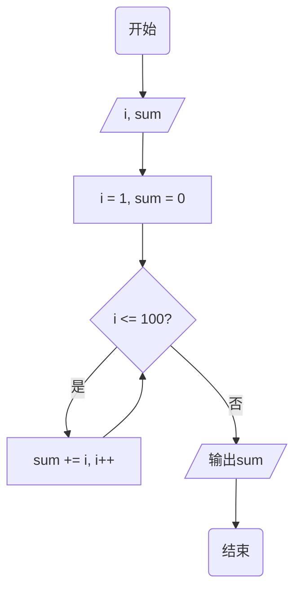


**编程语言（Programming Language）**

编程语言主要分为面向机器、面向过程和面向对象三类。C语言是面向过程的语言，常用于操作系统、嵌入式系统、驱动程序、图形引擎、图像处理、声音效果等。

Java是面向对象语言，吸收了C/C++的优点，并摒弃了难以理解的多继承、指针等概念。Java可以编写桌面应用程序、Web应用程序、分布式系统和嵌入式系统应用程序等。


<div style="page-break-after: always;"></div>

## 1.2 Hello World!

**Hello World!**

---

【代码】Hello World!

```java
public class HelloWorld {
    public static void main(String[] args) { 
        System.out.println("Hello World!");
    }
}
```

>  运行结果

```
Hello World!
```

---

第一行语句中的`public`为访问修饰符，一共有三种：`public`、`private`、`protected`。第一行中`class`表示一个类，类名需要与文件名相同。

第二行中的`main()`是程序的入口。

第三行的语句`System.out.println()`的作用是在屏幕上输出`Hello World`这个字符串。`;`表示语句结束，注意不要使用中文的分号。


**字节码文件**

Java编译器（compiler）的作用是将Java源程序编译成中间代码字节码文件。字节码文件是一种和任何具体机器环境及操作系统环境无关的中间代码。Java程序不能直接运行在现有的操作系统，必须运行在Java虚拟机上。Java的特点是一次编写，到处运行。

<div style="page-break-after: always;"></div>

## 1.3 Error or Warning?

**Error / Warning**

在编写程序的过程中，错误是不可避免的，错误主要能够分为以下三种类别：

1. 语法错误（syntax error）：程序的语法不合符编程语言的要求，编译器会反馈报错信息。
2. 逻辑错误（logical error）：人类在编程过程中的逻辑错误，无法被编译器所检测。
3. 运行时错误（runtime error）例如除以0、数组越界、指针越界、使用已经释放的空间、栈溢出等情况，可以被编译器发现。


<div style="page-break-after: always;"></div>

## 1.4 注释

**注释（Comment）**

在编程中加入注释可以增加程序的可读性和可维护性，编译器不会对注释的部分进行编译。

Java中注释分为两类：

1. 单行注释：将一行内`//`之后的内容视为注释。
2. 多行注释：以`\*`开始，`*/`结束，中间的内容视为注释。

---

【代码】注释

```java
/*
    这个程序在屏幕上输出Hello World
*/
public class Comment {
    // 主函数
    public static void main(String[] args) { 
        System.out.println("Hello World!");  // 输出
    }
}
```

>  运行结果

```
Hello World!
```

---

<div style="page-break-after: always;"></div>

## 1.5 不同语言的Hello World

**编程语言对比**

---

【代码】C

```c
#include <stdio.h>

int main() {
    printf("Hello World\n");
    return 0;
}
```

---

【代码】C++

```c++
#include <iostream>
using namespace std;

int main() {
    cout << "Hello World" << endl;
    return 0;
}
```

---

【代码】Python

```python
print("Hello World")
```

---

<div style="page-break-after: always;"></div>

# 第2章 数据类型

## 2.1 变量

**变量（Variable）**

Java是一种强类型的语言，任何数据都有一个确定的类型。

变量是计算机中一块特定的内存空间，由一个或多个连续的字节组成，不同数据存入具有不同内存地址的空间，相互独立，通过变量名可以简单快速地找到在内存中存储的数据。

变量名需要符合以下的要求：

1. 由字母、数字和下划线组成，第一个字符必须为字母或下划线
2. 不能包含除`_`以外的任何特殊字符，如`%`、`#`等
3. 不可以使用保留字或关键字
4. 准确、顾名思义，不要使用汉语拼音

关键字是编程语言内置的一些名称，具有特殊的用处和意义。

|  关键字  |         |        |          |
| :------: | :-----: | :----: | :------: |
| abstract   | do        | implements | protected |
| throws     | boolean   | double     | import    |
| public     | transient | break      | else      |
| instanceof | return    | true       | byte      |
| extends    | int       | short      | try       |
| case       | false     | interface  | static    |
| void       | catch     | final      | long      |
| strict     | volatile  | char       | finally   |
| native     | super     | while      | class     |


**数据类型**

Java中变量主要有三大类型：

1. 整型

    - 字节型`byte`

    - 短整型`short`
    - 整型`int`
    - 长整型`long`

2. 浮点型
    - 单精度浮点型`float`
    - 双精度浮点型`double`

3. 字符型`char`

4. 布尔型`boolean`

| 数据类型 | 位数 | 取值范围                    | 取值范围                 |
| :------: | :--: | --------------------------- | :----------------------- |
|   int    |  32  | $ -2^{31} \sim 2^{31} - 1 $ | -2147483648 ~ 2147483647 |
|  float   |  32  | $ -3.4E38 \sim 3.4E38 $     |                          |
|  double  |  64  | $ -1.7E308 \sim 1.7E308 $   |                          |
|   char   |  8   | $ -2^7 \sim 2^7 - 1 $       | -128 ~ 127               |
| boolean  |  1   | true / false                |                          |

<div style="page-break-after: always;"></div>

## 2.2 初始化

**初始化（Initialization）**

变量可以在定义时初始化，也可以在定义后初始化。

在编程中，`=`不是数学中的`等于`符号，而是表示`赋值`，即将`=`右边的值赋给左边的变量。

```c
int n = 10;
double wage = 8232.56;
```


**常量（Constant）**

常量是一个固定值，在程序执行期间不会改变，即在定义后不可修改。常量可以是任何的基本数据类型，比如整数常量、浮点常量、字符常量。

---

【代码】常量

```java
public class Contant {
    public static void main(String[] args) {
        final double PI = 3.14159;
        PI = 4;
    }
}
```

>  运行结果

```
The final local variable PI cannot be assigned.
```

---

<div style="page-break-after: always;"></div>

## 2.3 算术运算符

**四则运算**

|  数学符号  |  C符号   | 含义 |
| :--------: | :------: | :--: |
|   $ + $    |  $ + $   | 加法 |
|   $ - $    |  $ - $   | 减法 |
| $ \times $ | $ \ast $ | 乘法 |
|  $ \div $  |  $ / $   | 除法 |
|            |  $ \% $  | 取模 |

C语言中除法`/`的意义与数学中不同：

1. 当相除的两个运算数都为整型，则运算结果为两个数进行除法运算后的整数部分，例如`21 / 5`的结果为`4`。
2. 如果两个运算数其中至少一个为浮点型，则运算结果为浮点型，如`21 / 5.0`的结果为`4.2`。

取模（modulo）`%`表示求两个数相除之后的余数，如`22 % 3`的结果为`1`、`4 % 7`的结果为`4`。


**复合赋值运算符**

| 运算符 | 描述                  |
| :----: | :-------------------- |
|   +=   | a += b等价于a = a + b |
|   -=   | a -= b等价于a = a - b |
|   *=   | a *= b等价于a = a * b |
|   /=   | a /= b等价于a = a / b |
|   %=   | a %= b等价于a = a % b |

<div style="page-break-after: always;"></div>

## 2.4 输入输出函数

**System.out.println()**

`System.out.println()`的功能是向屏幕输出指定格式的字符串内容。通过`+`运算符可以连接两个字符串。

---

【代码】字符串连接

```java
public class StringConcatenation {
    public static void main(String[] args) {
        System.out.println("Hello" + "World");
        System.out.println("Hello" + 2);
        System.out.println("Hello" + 2 + 3);
        System.out.println(2 + 3 + "Hello");
    }
}
```

> 运行结果

```
HelloWorld
Hello2
Hello23
5Hello
```

---


**转义字符**

在一个字符串描述的过程中，有可能会有一些特殊字符的信息。

| 转义字符 | 描述                       |
| :------: | :------------------------- |
|    \     | 续行符，实现字符串多行定义 |
|   \\\    | 表示一个反斜杠`\`          |
|   \\'    | 表示一个单引号`'`          |
|   \\"    | 表示一个双引号`"`          |
|    \n    | 换行                       |
|    \t    | 横向制表符                 |
|    \v    | 纵向制表符                 |
|    \f    | 换页                       |
|    \b    | 退格                       |

---

【代码】转义字符

```java
public class EscapeCharacter {
    public static void main(String[] args) {
        System.out.print("全球最大同性交友网站\n");
        System.out.println("\'https://github.com\'");
    }
}
```

> 运行结果

```
全球最大同性交友网站
'https://github.com'
```

---


**Scanner**

通过`Scanner`类可以获取用户的输入，使用`Scanner`类需要导入`java.util.Scanner`。根据实例化的`Scanner`类的对象，调用`next()`和`nextLine()`方法可以获取输入的字符串。

使用完`Scanner`类的对象后，需要关闭输入流。

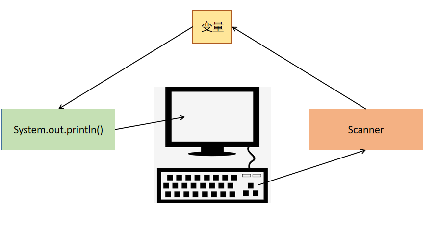

---

【代码】计算长方形面积

```c
import java.util.Scanner;

public class CircleArea {
	public static void main(String[] args) {
		Scanner scanner = new Scanner(System.in);
		double length, width;
		double area;
		
		System.out.print("输入长度：");
		length = scanner.nextDouble();
		System.out.print("输入宽度：");
		width = scanner.nextDouble();
		area = length * width;
		
		System.out.println(String.format("面积 = %.2f", area));
		scanner.close();
	}
}
```

> 运行结果

```
输入长度：20
输入宽度：30
面积 = 600.00
```

---

【代码】计算圆面积

```java
import java.util.Scanner;

public class CircleArea {
    public static void main(String[] args) {
        Scanner scanner = new Scanner(System.in);
        final double PI = 3.14159;
        double r;
        double area;
        
        System.out.print("输入半径：");
        r = scanner.nextDouble();
        area = PI * r * r;
        
        System.out.println(String.format("面积 = %.2f", area));
        scanner.close();
    }
}
```

> 运行结果

```
输入半径：5
面积 = 78.539750
```

---

【代码】逆序三位数

```java
import java.util.Scanner;

public class Reverse {
    public static void main(String[] args) {
        Scanner scanner = new Scanner(System.in);
        int num;
        int a, b, c;
        
        System.out.print("输入一个三位数：");
        num = scanner.nextInt();
        
        a = num / 100;
        b = num / 10 % 10;
        c = num % 10;
        
        System.out.println("逆序：" + (c*100 + b*10 + a));
        scanner.close();
    }
}
```

> 运行结果

```
输入一个正三位数：520
逆序：25
```

---

<div style="page-break-after: always;"></div>

## 2.5 类型转换

**类型转换**

类型转换是把变量从一种类型转换为另一种数据类型。类型转换可以是隐式的，由编译器自动执行，也可以是显式的，通过使用强制类型转换运算符来指定。在有需要类型转换时都用上强制类型转换运算符是一种良好的编程习惯。

---

【代码】隐式类型转换

```java
public class Implitcit {
    public static void main(String[] args) {
        int a = 1;
        double b = a;
        System.out.println("b = " + b);
    }
}
```

> 运行结果

```
b = 2
```

---

【代码】显式类型转换

```java
public class Explicit {
    public static void main(String[] args) {
        int sum = 821;
        int num = 10;
        double average;

        average = (double)sum / num;
        System.out.println(String.format("average = %.2f", average));
    }
}
```

> 运行结果

```
82.10
```

---

<div style="page-break-after: always;"></div>

# 第3章 判断

## 3.1 逻辑运算符

**关系运算符**

| 数学符号 | 关系运算符 |
| :------: | :--------: |
|  $ < $   |   $ < $    |
|  $ > $   |   $ > $    |
| $ \leq $ |   $ <= $   |
| $ \geq $ |   $ >= $   |
| $ \neq $ |   $ != $   |
|  $ = $   |   $ == $   |


**逻辑运算符**

C语言中逻辑运算符有三种：

1. 逻辑与`&&`（logical AND）：当多个条件同时为真，结果为真。

| 条件1 | 条件2 | 条件1 && 条件2 |
| :---: | :---: | :------------: |
|   T   |   T   |       T        |
|   T   |   F   |       F        |
|   F   |   T   |       F        |
|   F   |   F   |       F        |

2. 逻辑或`||`（logical OR）：多个条件有一个为真时，结果为真。

| 条件1 | 条件2 | 条件1 \|\| 条件2 |
| :---: | :---: | :--------------: |
|   T   |   T   |        T         |
|   T   |   F   |        T         |
|   F   |   T   |        T         |
|   F   |   F   |        F         |

3. 逻辑非`!`（logical NOT）：条件为真时，结果为假；条件为假时，结果为真。

| 条件 | !条件 |
| :--: | :---: |
|  T   |   F   |
|  F   |   T   |

<div style="page-break-after: always;"></div>

## 3.2 if

**if**

当`if`语句的条件为真时，进入花括号执行内部的代码；若条件为假，则跳过花括号执行后面的代码。

`if`语句主要有以下几种形式：

- 单分支

```java
if(条件) {
    // code
}
```

- 双分支

```java
if(条件) {
    // code
} else {
    // code
}
```

- 多分支

```java
if(条件1) {
    // code
} else if(条件2) {
    // code
} else {
    // code
}
```


---

【代码】if

```java
public class IfStmt {
    public static void main(String[] args) {
        int age = 15;
        if(age > 0 && age < 18) {
            System.out.println("未成年");
        }
    }
}
```

> 运行结果

```
未成年
```

---

【代码】if-else

```java
public class IfElse {
    public static void main(String[] args) {
        int age = 30;
        if(age > 0 && age < 18) {
            System.out.println("未成年人");
        } else {
            System.out.println("成年人");
        }
    }
}
```

> 运行结果

```
成年人
```

---

【代码】if-else_if-else

```java
public class IfElseifElse {
    public static void main(String[] args) {
        int score = 76;

        if(score >= 90 && score <= 100) {
            System.out.println("优秀");
        } else if(score >= 60) {
            System.out.println("合格");
        } else {
            System.out.println("不合格");
        }
    }
}
```

> 运行结果

```
合格
```

---


**嵌套结构**

`if`语句也可以嵌套使用：

```java
if(条件1) {
    if(条件2) {
        // code
    }
}
```

---

【代码】判断整数奇偶

```java
import java.util.Scanner;

public class OddEven {
    public static void main(String[] args) {
        Scanner scanner = new Scanner(System.in);
        int num;
        
        System.out.print("输入一个正整数：");
        num = scanner.nextInt();
        
        if(num > 0) {
            if(num % 2 == 0) {
                System.out.println(num + "是偶数");
            } else {
                System.out.println(num + "是奇数");
            }
        }
        
        scanner.close();
    }
}
```

> 运行结果

```
输入一个正整数：66
66是偶数
```

---

<div style="page-break-after: always;"></div>

## 3.3 switch

**switch**

`switch-case`结构可以对整数值的表达式进行判断。

```java
switch(表达式) {
    case label:
        //code
        break;
    // ...
    default:
        //code
        break;
}
```

根据表达式的值，跳转到对应的`case`处进行执行。需要注意的是，当对应的`case`中的代码被执行完后，并不会跳出`switch`，而是会继续执行后面的代码，所以需要使用`break`跳出`switch`结构。

当所有`case`都不满足表达式的值时，会执行`default`语句中的代码，相当于`if-else`结构中的`else`。

---

【代码】根据月份输出对应的英语简写

```java
import java.util.Scanner;

public class Month {
    public static void main(String[] args) {
        Scanner scanner = new Scanner(System.in);
        int month;
        System.out.print("输入月份：");
        month = scanner.nextInt();
        
        switch(month) {
            case 1:
                System.out.println("Jan.");
                break;
            case 2:
                System.out.println("Feb.");
                break;
            case 3:
                System.out.println("Mar.");
                break;
            case 4:
                System.out.println("Apr.");
                break;
            case 5:
                System.out.println("May");
                break;
            case 6:
                System.out.println("Jun.");
                break;
            case 7:
                System.out.println("Jul.");
                break;
            case 8:
                System.out.println("Aug.");
                break;
            case 9:
                System.out.println("Sep.");
                break;
            case 10:
                System.out.println("Oct.");
                break;
            case 11:
                System.out.println("Nov.");
                break;
            case 12:
                System.out.println("Dec.");
                break;
            default:
                System.out.println("输入有误");
                break;
        }
        scanner.close();
    }
}
```

> 运行结果

```
输入月份：5
May
```

---

<div style="page-break-after: always;"></div>

# 第4章 循环

## 4.1 自增/自减运算符

**自增/自减运算符**

单目运算符中自增`++`和自减`--`运算符可以将变量的值加1和减1，但是`++`和`--`可以出现在变量之前或之后，即有四种情况：

1. 前缀自增
2. 前缀自减
3. 后缀自增
4. 后缀自减

| 表达式  | 含义                 |
| :-----: | -------------------- |
| count++ | 执行完所在语句后自增 |
| ++count | 执行所在语句前自增   |
| count-- | 执行完所在语句后自减 |
| --count | 执行所在语句前自减   |

<div style="page-break-after: always;"></div>

## 4.2 while

**while**

在`while`循环中，当条件满足时重复循环体内的语句。如果条件永远为真，循环会永无止境的进行下去（死循环），因此循环体内要有改变条件的机会。

控制循环次数的方法就是设置循环变量：初值、判断、更新。

`while`循环的特点是先判断、再执行，所以循环体有可能会进入一次或多次，也有可能一次也不会进入。

```java
while(条件) {
    // code
}
```

---

【代码】计算5个人的平均身高

```java
import java.util.Scanner;

public class Height {
    public static void main(String[] args) {
        Scanner scanner = new Scanner(System.in);
        double height;
        double total = 0;
        double average;
        int i = 1;
        
        while(i <= 5) {
            System.out.print("输入第" + i + "个人的身高：");
            height = scanner.nextDouble();
            total += height;
            i++;
        }
        
        average = total / 5;
        System.out.println(String.format("平均身高：%.2f", average));        
        scanner.close();
    }
}
```

> 运行结果

```
输入第1个人的身高：160.8
输入第2个人的身高：175.2
输入第3个人的身高：171.2
输入第4个人的身高：181.3
输入第5个人的身高：164
平均身高：170.5
```

---

<div style="page-break-after: always;"></div>

## 4.3 do-while

**do-while**

`do-while`循环在进入循环的时候不做检查，而是在执行完一轮循环体的代码之后，再来检查循环的条件是否满足，如果满足则继续下一轮循环，不满足则结束循环，即至少执行一次循环。

`do-while`循环的主要特点是先执行、再判断。

```java
do {
    // code
} while(条件);
```

---

【代码】计算整数位数

```java
import java.util.Scanner;

public class Digits {
    public static void main(String[] args) {
        Scanner scanner = new Scanner(System.in);
        int num;
        int n = 0;      // 位数
        
        System.out.print("输入整数：");
        num = scanner.nextInt();
        
        do {
            num /= 10;
            n++;
        } while(num != 0);
        
        System.out.println("位数：" + n);
        scanner.close();
    }
}
```

> 运行结果

```
输入整数：123
位数：3
```

---


**while与do-while区别**

`while`循环与`do-while`循环有以下区别：

1. 执行顺序不同。
2. 初始情况不满足循环条件时，`while`循环一次都不会执行，`do-while`循环不管任何情况都至少执行一次。
3. `do-while`循环的`while`语句后有`;`。


---

【代码】猜数字

```java
import java.util.Scanner;

public class GuessNumber {
    public static void main(String[] args) {
        Scanner scanner = new Scanner(System.in);
        int answer = (int)(Math.random() * 100) + 1;    // [1, 100]
        int guess;
        int cnt = 0;        // 猜测次数
        
        do {
            System.out.print("猜一个1-100之间的数：");
            guess = scanner.nextInt();
            cnt++;
            if(guess < answer) {
                System.out.println("猜小啦！");
            } else if(guess > answer) {
                System.out.println("猜大啦！");
            }
        } while(guess != answer);
        
        System.out.println("猜对啦！一共猜了" + cnt + "次！");
        scanner.close();
    }
}
```

> 运行结果

```
猜一个1-100之间的数字：50
猜大了！
猜一个1-100之间的数字：25
猜小了！
猜一个1-100之间的数字：37
猜小了！
猜一个1-100之间的数字：43
猜小了！
猜一个1-100之间的数字：46
猜小了！
猜一个1-100之间的数字：48
猜小了！
猜一个1-100之间的数字：49
猜对了！你一共用了7次猜对！
```

---

<div style="page-break-after: always;"></div>

## 4.4 for

**for**

`for`循环有三个表达式，中间用`;`分隔，`;`不可省略。

```c
for(表达式1; 表达式2; 表达式3) {
    //code
}
```

- 表达式1通常是为循环变量赋初值，可省略
- 表达式2是循环条件，判断是否继续执行循环，可省略
- 表达式3为更新循环变量的值，可省略

---

【代码】计算1-100的累加和

```java
public class Sum {
    public static void main(String[] args) {
        int sum = 0;
        for(int i = 1; i <= 100; i++) {
            sum += i;
        }
        System.out.println(sum);
    }
}
```

> 运行结果

```
5050
```

---

【代码】计算$ 1 + {1 \over 2} + {1 \over 3} + ... + {1 \over n} $

```java
import java.util.Scanner;

public class InverseSum {
    public static void main(String[] args) {
        Scanner scanner = new Scanner(System.in);
        int n;
        double sum = 0.0;
        
        System.out.print("输入n：");
        n = scanner.nextInt();
        
        for(int i = 1; i <= n; i++) {
            sum += 1.0 / i;
        }
        
        System.out.println(sum);
        scanner.close();
    }
}
```

> 运行结果

```
输入n：10
2.928968
```

---

【代码】斐波那契数列（兔子数列）


```java
import java.util.Scanner;

public class Fibonacci {
    public static void main(String[] args) {
        Scanner scanner = new Scanner(System.in);
        int n;
        int num1, num2, val;
        
        System.out.print("输入斐波那契数列长度：");
        n = scanner.nextInt();
        
        if(n == 1) {
            System.out.println("1");
        } else if(n == 2) {
            System.out.println("1, 1");
        } else {
            num1 = 1;
            num2 = 1;
            System.out.print("1, 1");
            for(int i = 3; i <= n; i++) {
                val = num1 + num2;
                System.out.print(", " + val);
                num1 = num2;
                num2 = val;
            }
            System.out.println();
        }
        scanner.close();
    }
}
```

> 运行结果

```
输入斐波那契数列长度：10
1, 1, 2, 3, 5, 8, 13, 21, 34, 55
```

---


**嵌套循环**

循环也可以进行嵌套使用。

---

【代码】九九乘法表


```java
public class MultiplicationTable {
    public static void main(String[] args) {
        for(int i = 1; i <= 9; i++) {
            for(int j = 1; j <= 9; j++) {
                System.out.print(String.format("%d*%d=%d\t", i, j, i*j));
            }
            System.out.println();
        }
    }
}
```

---

【代码】输出图案

```
*
**
***
****
*****
```

```java
public class Stars {
    public static void main(String[] args) {
        for(int i = 1; i <= 5; i++) {
            for(int j = 1; j <= i; j++) {
                System.out.print("*");
            }
            System.out.println();
        }
    }
}
```

---

<div style="page-break-after: always;"></div>

## 4.5 break or continue?

**循环控制**

循环控制语句的作用是控制当前的循环结构是否继续向下执行，如果不进行控制，那么会根据既定的结构重复执行。如果有一些特殊的情况导致循环的执行中断，就称为循环的控制语句。循环控制语句的关键字有`break`和`continue`。

`break`的作用是跳出当前循环，执行当前循环之后的语句。`break`只能跳出一层循环，如果是嵌套循环，那么需要按照嵌套的层次，逐步使用`break`来跳出。`break`语句只能在循环体内和`switch`语句内使用。

`continue`的作用是跳过本轮循环，开始下一轮循环的条件判断。`continue`终止当前轮的循环过程，但它并不跳出循环。

---

【代码】break

```java
public class Break {
    public static void main(String[] args) {
        for(int i = 1; i <= 10; i++) {
            if(i == 5) {
                break;
            }
            System.out.print(i + " ");
        }
    }
}
```

> 运行结果

```
1 2 3 4 
```

---

【代码】continue

```java
public class Continue {
    public static void main(String[] args) {
        for(int i = 1; i <= 10; i++) {
            if(i == 5) {
                continue;
            }
            System.out.print(i + " ");
        }
    }
}
```

> 运行结果

```
1 2 3 4 6 7 8 9 10
```

---

<div style="page-break-after: always;"></div>

# 第5章 数组

## 5.1 一维数组

**数组（Array）**

数组可以用于声明多个具有相同类型的变量，它们共享同一个名字，数组中的每个变量都能被其下标所访问。数组一旦创建就不能改变大小。

```java
int[] number = new int[10];
float[] grade = new float[50];
```

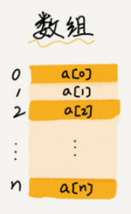

- 元素：数组中的每个变量

- 大小：数组的容量

- 下标 / 索引（index）：元素的位置，下标从0开始，必须为非负整数


**数组初始化**

一维数组可以在声明时进行初始化：

```java
int[] arr = {3, 6, 8, 2, 4, 0, 9, 7, 1, 5};
int[] arr = new int[] {3, 6, 8, 2, 4, 0, 9, 7, 1, 5};
```

很多时候在使用数组之前需要将数组的内容全部清空，这可以利用循环来实现。

```java
public class InitArr {
    public static void main(String[] args) {
        int[] arr = new int[100];
        for(int i = 0; i < arr.length; i++) {
            arr[i] = 0;
        }
    }
}
```

---

【代码】数组最大值和最小值

```java
public class MaxMin {
    public static void main(String[] args) {
        int[] num = {7, 6, 2, 9, 3, 1, 4, 0, 5, 8};
        int max = num[0];
        int min = num[0];

        for(int i = 1; i < num.length; i++) {
            if(num[i] > max) {
                max = num[i];
            } else if(num[i] < min) {
                min = num[i];
            }
        }

        System.out.println("max = " + max);
        System.out.println("min = " + min);
    }
}
```

> 运行结果

```
max = 9
min = 0
```

---


**for-each**

`for-each`循环是for循环的特殊简化版。

```java
for(dataType var : set) {
    // code
}
```

---

【代码】遍历数组

```java
public class ForEach {
    public static void main(String[] args) {
        int[] arr = {7, 6, 2, 9, 3, 1, 4, 0, 5, 8};
        for(int elem : arr) {
            System.out.print(elem + " ");
        }
    }
}
```

> 运行结果

```
7 6 2 9 3 1 4 0 5 8
```

---

<div style="page-break-after: always;"></div>

## 5.2 二维数组

**二维数组（2D Array）**

二维数组包括行和列两个维度，可以看成是由多个一维数组组成。

|  二维数组   |             |             |             |
| :---------: | :---------: | :---------: | :---------: |
| a\[0\]\[0\] | a\[0\]\[1\] | a\[0\]\[2\] | a\[0\]\[3\] |
| a\[1\]\[0\] | a\[1\]\[1\] | a\[1\]\[2\] | a\[1\]\[3\] |
| a\[2\]\[0\] | a\[2\]\[1\] | a\[2\]\[2\] | a\[2\]\[3\] |

二维数组可以在声明时进行初始化：

```java
int[][] arr = new int[2][3];
int[][] arr = {{1, 2, 3}, {4, 5, 6}};
```


---

【代码】初始化二维数组

```java
public class Init2dArr {
   public static void main(String[] args) {
       int[][] arr = new int[3][4];
       for(int i = 0; i < arr.length; i++) {
           for(int j = 0; j < arr[i].length; j++) {
               arr[i][j] = 0;
           }
       }
   } 
}
```

---

【代码】矩阵运算

> 矩阵的加法/减法是指两个矩阵把其相对应元素进行加减的运算。
>
> 矩阵加法：两个$ m \times n $矩阵A和B的和，标记为$ A + B $，结果为一个$ m \times n $的矩阵，其内的各元素为其相对应元素相加后的值。
>
> 矩阵减法：两个$ m \times n $矩阵A和B的差，标记为$ A - B $，结果为一个$ m \times n $的矩阵，其内的各元素为其相对应元素相减后的值。
> 
> $$
> \left[\begin{matrix} 
> 	1 & 3 \\
> 	1 & 0 \\
> 	1 & 2 \\
> \end{matrix} \right]
> +
> \left[\begin{matrix} 
> 	0 & 0 \\
> 	7 & 5 \\
> 	2 & 1 \\
> \end{matrix} \right]
> =
> \left[\begin{matrix} 
> 	1+0 & 3+0 \\
> 	1+7 & 0+5 \\
> 	1+2 & 2+1 \\
> \end{matrix} \right]
> =
> \left[\begin{matrix} 
> 	1 & 3 \\
> 	8 & 5 \\
> 	3 & 3 \\
> \end{matrix} \right]
> $$
>
> $$
> \left[\begin{matrix} 
> 	1 & 3 \\
> 	1 & 0 \\
> 	1 & 2 \\
> \end{matrix} \right]
> -
> \left[\begin{matrix} 
> 	0 & 0 \\
> 	7 & 5 \\
> 	2 & 1 \\
> \end{matrix} \right]
> =
> \left[\begin{matrix} 
> 	1-0 & 3-0 \\
> 	1-7 & 0-5 \\
> 	1-2 & 2-1 \\
> \end{matrix} \right]
> =
> \left[\begin{matrix} 
> 	1 & 3 \\
> 	-6 & -5 \\
> 	-1 & 1 \\
> \end{matrix} \right]
> $$

```java
public class Matrix {
    public static void main(String[] args) {
        int[][] A = {
            {1, 3},
            {1, 0},
            {1, 2}
        };
        int[][] B = {
            {0, 0},
            {7, 5},
            {2, 1}
        };
        int[][] C = new int[3][2];

        System.out.println("矩阵加法");
        for(int i = 0; i < 3; i++) {
            for(int j = 0; j < 2; j++) {
                C[i][j] = A[i][j] + B[i][j];
                System.out.print(String.format("%3d", C[i][j]));
            }
            System.out.println();
        }

        System.out.println("矩阵减法");
        for(int i = 0; i < 3; i++) {
            for(int j = 0; j < 2; j++) {
                C[i][j] = A[i][j] - B[i][j];
                System.out.print(String.format("%3d", C[i][j]));
            }
            System.out.println();
        }
    }
}
```

> 运行结果

```
矩阵加法
1  3
8  5
3  3
矩阵减法
1  3
-6 -5
-1  1
```

---

<div style="page-break-after: always;"></div>

## 5.3 字符

**字符（Character）**

单个的字符是一种特殊的类型，是用单引号表示字符字面量。每一个字符都有其对应的码值。

`ASCII`全称`American Standard Code for Information Interchange`（美国信息交换标准代码），一共定义了128个字符。


---

【代码】ASCII码

```java
public class ASCII {
    public static void main(String[] args) {
        for(int i = 0; i < 128; i++) {
            System.out.println(String.format("%c - %d", i, i));
        }
    }
}
```

---

<div style="page-break-after: always;"></div>

## 5.4 字符串

**字符串（String）**

字符串是用双引号所表示的0个或多个字符的组合。字符串变量使用`String`表示，`String`是一个类，`String`的变量是对象的管理者而非所有者。

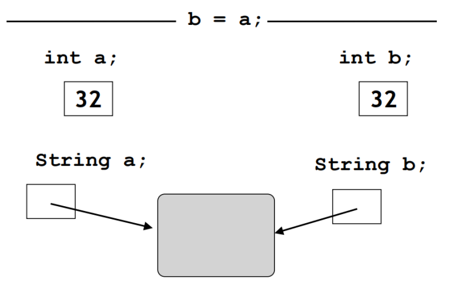

通过调用`Scanner`类中的`nextLine()`方法可以获取用户输入的字符串。

---

【代码】创建字符串对象

```java
import java.util.Scanner;

public class StringObj {
    public static void main(String[] args) {
        Scanner scanner = new Scanner(System.in);
        System.out.print("输入字符串：");
        String str = scanner.nextLine();
        System.out.println(str);
        scanner.close();
    }  
}
```

> 运行结果

```
输入字符串：Hello World!
Hello World!
```

---


**字符串比较**

字符串的比较分为两种：

1. `==`运算符用于比较是否是同一个对象。
2. `equals()`方法用于比较字符串的内容是否相同。

---

【代码】字符串比较

```java
public class StringEqual {
    public static void main(String[] args) {
        String s1 = new String("hello");
        String s2 = new String("hello");

        if(s1 == s2) {
            System.out.println("s1和s2是同一个对象");
        }

        if(s1.equals(s2)) {
            System.out.println("s1与s2内容相同");
        }

        if(s1.equalsIgnoreCase(s2)) {
            System.out.println("s1与s2忽略大小写内容相同");
        }
    }
}
```

> 运行结果

```
s1与s2内容相同
s1与s2忽略大小写内容相同
```

---


**字符串操作**

字符串是对象，它包含了一系列的常用操作，对它的所有操作都是通过`.`运算符进行的。

1. `length()`：计算字符串长度。

---

【代码】计算字符串长度

```java
public class StringLength {
    public static void main(String[] args) {
        String str = "Hello World!";
        System.out.println(str.length());
    }
}
```

> 运行结果

```
12
```

---

2. 访问字符串中的字符：字符串中的每一个下标位置都是一个单个的字符，下标的范围从`0`到`length() - 1`。

---

【代码】获取字符串中的字符

```java
public class CharAt {
    public static void main(String[] args) {
        String str = "Hello World!";
        System.out.println(str.charAt(4));
    }
}
```

> 运行结果

```
o
```

---

【代码】计算字符串中某个字符出现的次数

```java
import java.util.Scanner;

public class CountOccurence {
    public static void main(String[] args) {
        Scanner scanner = new Scanner(System.in);
        int cnt = 0;        // 出现次数

        System.out.print("输入字符串：");
        String str = scanner.nextLine();
        System.out.print("输入待统计字符：");
        char c = scanner.nextLine().charAt(0);

        int n = str.length();
        for(int i = 0; i < n; i++) {
            if(str.charAt(i) == c) {
                cnt++;
            }
        }

        System.out.println(c + "在" + str + "中出现了" + cnt + "次");
        scanner.close();
    }
}
```

> 运行结果

```
输入字符串：Hello World
输入待统计字符：l
l在Hello World中出现了3次
```

---

3. 获取子串（substring）：
    - `substring(n)`：获取第`n`个位置到末尾的全部内容。
    - `substring(begin, end)`：获取从`begin`到`end`位置之前的内容。

---

【代码】获取子串

```java
public class Substring {
    public static void main(String[] args) {
        String str = "Hello World!";
        System.out.println(str.substring(6));
        System.out.println(str.substring(3, 10));
    }
}
```

> 运行结果

```
World!
lo Worl
```

---

4. 查找：
    - `indexOf(c)`：获取字符`c`所在的位置，返回`-1`表示不存在。
    - `indexOf(c, n)`：从第`n`个位置开始查找字符`c`。
    - `indexOf(t)`：获取字符串`t`所在的位置。

---

【代码】查找

```java
public class IndexOf {
    public static void main(String[] args) {
        String str = "Hello World!";
        System.out.println(str.indexOf('o'));
        System.out.println(str.indexOf('l', 4));
        System.out.println(str.indexOf("llo"));
    }
}
```

> 运行结果

```
4
9
2
```

---

5. 字符串大小写转换：
    - `toLowerCase()`：将字符串转换为小写。
    - `toUpperCase()`：将字符串转换为大写。

---

【代码】字符串大小写转换

```java
public class UpperLowerCase {
    public static void main(String[] args) {
        String str = "Hello World!";
        System.out.println(str.toLowerCase());
        System.out.println(str.toUpperCase());
    }
}
```

> 运行结果

```
hello world
HELLO WORLD
```

---

6. 字符串替换：
    - `replace(c1, c2)`：将所有字符`c1`替换为字符`c2`，返回新字符串。
    - `replace(s1, s2)`：将所有子串`c1`替换为子串`c2`，返回新字符串。

---

【代码】字符串替换

```java
public class Replace {
    public static void main(String[] args) {
        String str = "Hello World!";
        System.out.println(str.replace('l', '*'));
        System.out.println(str.replace("ll", "##"));
    }
}
```

> 运行结果

```
He**o Wor*d!
He##o World!
```

---

7. 字符串分割`split(regex)`：根据匹配给定的正则表达式拆分字符串，返回拆分后的字符串数组。

---

【代码】字符串分割

```java
public class Split {
    public static void main(String[] args) {
        String str = "This is a string.";
        String[] s = str.split(" ");
        for(String item : s) {
            System.out.println(item);
        }
    }
}
```

> 运行结果

```
This
is
a
string.
```

---

【代码】统计单词个数

```java
import java.util.Scanner;

public class CountWord {
    public static void main(String[] args) {
        Scanner scanner = new Scanner(System.in);
        System.out.print("输入英语句子：");
        String str = scanner.nextLine();
        
        //"\\s+"表示一个或多个空格、回车、制表符等空白符
        String[] words = str.split("\\s+");
        System.out.println("单词个数：" + words.length);
        for(String word : words) {
            System.out.println("\t" + word);
        }
        
        scanner.close();
    }
}
```

> 运行结果

```
输入英语句子：This is a string.
单词个数：4
	This
	is
	a
	string.
```

---

<div style="page-break-after: always;"></div>

# 第6章 函数

## 6.1 函数

**函数（Function）**

函数执行一个特定的任务，每个C程序都至少有一个函数`main()`。C标准库提供了大量内置函数，例如`strlen()`用来计算字符串的长度、`printf()`用来进行格式化输出等。


当调用函数时，程序控制权会转移给被调用的函数，当函数执行结束后，函数会把程序序控制权交还给其调用者。

```mermaid
graph TB
	subgraph Callee
		code2 --> code3
	end

	subgraph Caller
		code1 --> call
		call --> code5
	end
	
	call --> code2
	code3 --> call
```


**函数声明与定义**

函数声明时需要指定函数的名称、返回类型和参数。在函数声明时，参数的名称可以省略，但是参数的类型是必须的。

```java
AccessModifier dataType funcName(parameterList) {
    //code
}
```

函数的参数列表包括参数的类型、顺序、数量等信息，参数列表可以为空。

函数可以返回一个值，函数的返回类型为被返回的值的类型。函数也可以不返回任何值，此时函数的返回类型应定义为`void`。


**函数设计方法**

为什么不把所有的代码全部写在`main()`中，还需要自定义函数呢？

使用函数有以下好处：

1. 避免代码复制，代码复制是程序质量不良的表现
2. 便于代码维护
3. 避免重复造轮子，提高开发效率

在设计函数的时候需要考虑以下的几点要素：

1. 确定函数的功能
2. 确定函数的参数
    - 是否需要参数
    - 参数个数
    - 参数类型
3. 确定函数的返回值
    - 是否需要返回值
    - 返回值类型

---

【代码】函数实现返回最大值

```java
public class Max {
    public static void main(String[] args) {
        System.out.println(max(4, 12));
        System.out.println(max(54, 33));
        System.out.println(max(0, -12));
        System.out.println(max(-999, -774));
    }

    public static int max(int num1, int num2) {
        // if(num1 > num2) {
        //     return num1;
        // } else {
        //     return num2;
        // }
        return num1 > num2 ? num1 : num2;
    }
}
```

> 运行结果

```
12
54
0
-774
```

---

【代码】函数实现累加和

```java
public class Sum {
    public static void main(String[] args) {
        System.out.println("1-100的累加和 = " + sum(1, 100));
        System.out.println("1024-2048的累加和 = "+ sum(1024, 2048));
    }

    public static int sum(int start, int end) {
        int total = 0;
        for(int i = start; i <= end; i++) {
            total += i;
        }
        return total;
    }
}
```

> 运行结果

```
1-100的累加和 = 5050
1024-2048的累加和 = 1574400
```

---

【代码】函数实现输出i行j列由自定义字符组成的图案

```java
public class PrintChars {
    public static void main(String[] args) {
        printChars(5, 10, '?');
    }

    public static void printChars(int row, int col, char c) {
        for(int i = 0; i < row; i++) {
            for(int j = 0; j < col; j++) {
                System.out.print(c);
            }
            System.out.println();
        }
    }
}
```

> 运行结果

```
??????????
??????????
??????????
??????????
??????????
```

---

<div style="page-break-after: always;"></div>

## 6.2 递归

**递归（Recursion）**

要理解递归，先得理解递归（见6.2章节）。

在函数的内部，直接或者间接的调用自己的过程就叫作递归。对于一些问题，使用递归可以简洁易懂的解决问题，但是递归的缺点是性能低，占用大量系统栈空间。

递归算法很多时候可以处理一些特别复杂、难以直接解决的问题。

比如：

- 迷宫
- 汉诺塔
- 八皇后
- 排序
- 搜索

在定义递归函数时，一定要确定一个结束条件，否则会造成无限递归的情况，最终会导致栈溢出。


---

【代码】无限递归

```java
public class TellStory {
    public static void main(String[] args) {
        tellStory();
    }
    
    public static void tellStory() {
        System.out.println("从前有座山");
        System.out.println("山里有座庙");
        System.out.println("庙里有个老和尚和小和尚");
        System.out.println("老和尚在对小和尚讲故");
        System.out.println("他讲的故事是：");
        tellStory();
    }
}
```

> 运行结果

```
从前有座山
山里有座庙
庙里有个老和尚和小和尚
老和尚对小和尚在讲故事
他讲的故事是：
从前有座山
山里有座庙
庙里有个老和尚和小和尚
老和尚对小和尚在讲故事
他讲的故事是：
...
```

---

递归函数一般需要定义递归的出口，即结束条件，确保递归能够在适合的地方退出。

---

【代码】阶乘

```java
public class Factorial {
    public static void main(String[] args) {
        System.out.println("5! = " + factorial(5));
    }
    
    public static int factorial(int n) {
        if(n == 0 || n == 1) {
            return 1;
        }
        return n * factorial(n-1);
    }
}
```

> 运行结果

```
5! = 120
```

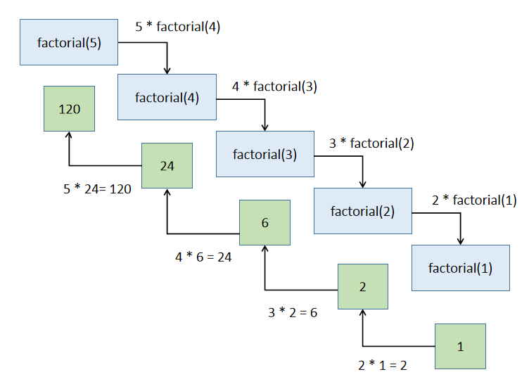

---

【代码】斐波那契数列（递归）

```java
public class FibonacciRecursive {
    public static void main(String[] args) {
        int n = 7;
        System.out.println("斐波那契数列第" + n + "位："+ fibonacci(n));
    }
    
    public static int fibonacci(int n) {
        if(n == 1 || n == 2) {
            return 1;
        }
        return fibonacci(n-2) + fibonacci(n-1);
    }
}
```

> 运行结果

```
斐波那契数列第7位：13
```


---

【代码】斐波那契数列（迭代）

```java
public class FibonacciIterative {
    public static void main(String[] args) {
        int n = 7;
        System.out.println("斐波那契数列第" + n + "位："+ fibonacci(n));
    }
    
    public static int fibonacci(int n) {
        int[] f = new int[n];
        f[0] = f[1] = 1;
        for(int i = 2; i < n; i++) {
            f[i] = f[i-2] + f[i-1];
        }
        return f[n-1];
    }
}
```

> 运行结果

```
斐波那契数列第7位：13
```

---

【代码】阿克曼函数
$$
A(m, n) =
\begin{cases}
	n + 1 & m = 0 \\
	A(m-1, 1) & m > 0, n = 0 \\
	A(m-1, A(m, n-1)) & m > 0, n > 0 \\
\end{cases}
$$

```java
public class Ackermann {
    public static void main(String[] args) {
        System.out.println(A(3, 4));
    }
    
    public static int A(int m, int n) {
        if(m == 0) {
            return n + 1;
        } else if(m > 0 && n == 0) {
            return A(m-1, 1);
        } else {
            return A(m-1, A(m, n-1));
        }
    }
}
```

> 运行结果

```
125
```

|  m\n  |      0      |         1         |         2         |            3            |         4         |                           n                            |
| :---: | :---------: | :---------------: | :---------------: | :---------------------: | :---------------: | :----------------------------------------------------: |
| **0** |      1      |         2         |         3         |            4            |         5         |                       $ n + 1 $                        |
| **1** |      2      |         3         |         4         |            5            |         6         |                  $ 2 + (n + 3) - 3 $                   |
| **2** |      3      |         5         |         7         |            9            |        11         |                    $ 2(n + 3) - 3 $                    |
| **3** |      5      |        13         |        29         |           61            |        125        |                   $ 2^{n + 3} - 3 $                    |
| **4** |     13      |       65533       | $ 2^{65536} - 3 $ | $ A(3, 2^{65536} - 3) $ | $ A(3, A(4, 3)) $ | $ \underbrace{2^{2^{.^{.^{.{^2}}}}}}_{n+3\ twos} - 3 $ |
| **5** |    65533    |  $ A(4, 65533) $  | $ A(4, A(5, 1)) $ |    $ A(4, A(5, 2)) $    | $ A(4, A(5, 3)) $ |                       $ \dots $                        |
| **6** | $ A(5, 1) $ | $ A(5, A(5, 1)) $ | $ A(5, A(6, 1)) $ |    $ A(5, A(6, 2)) $    | $ A(5, A(6, 3)) $ |                       $ \dots $                        |


---

【代码】汉诺塔

给定三根柱子，其中A柱子从大到小套有n个圆盘，问题是如何借助B柱子，将圆盘从A搬到C。

> 规则：
>
> - 一次只能搬动一个圆盘
> - 不能将大圆盘放在小圆盘上面


递归算法求解汉诺塔问题：

1. 将前n-1个圆盘从A柱借助于C柱搬到B柱。
2. 将最后一个圆盘直接从A柱搬到C柱。
3. 将n-1个圆盘从B柱借助于A柱搬到C柱。

```java
public class Hanoi {
    public static int move = 0;         // 移动次数
    
    public static void main(String[] args) {
        hanoi(4, 'A', 'B', 'C');
        System.out.println("步数==>" + move);
    }
    
    /**
     * @brief  汉诺塔算法
     * @note   把 n 个盘子从 src 借助 mid 移到 dst
     * @param  n: 层数
     * @param  src: 起点柱子
     * @param  mid: 临时柱子
     * @param  dst: 目标柱子
     */
    public static void hanoi(int n, char src, char mid, char dst) {
        if(n == 1) {
            System.out.println(n + "号盘：" + src + "->" + dst);
            move++;
        } else {
            // 把前 n-1 个盘子从 src 借助 dst 移到 mid
            hanoi(n-1, src, dst, mid);
            // 移动第 n 个盘子
            System.out.println(n + "号盘：" + src + "->" + dst);
            move++;
            // 把刚才的 n-1 个盘子从 mid 借助 src 移到 dst
            hanoi(n-1, mid, src, dst);
        }
    }
}
```

> 运行结果

```
1号盘：A -> B
2号盘：A -> C
1号盘：B -> C
3号盘：A -> B
1号盘：C -> A
2号盘：C -> B
1号盘：A -> B
4号盘：A -> C
1号盘：B -> C
2号盘：B -> A
1号盘：C -> A
3号盘：B -> C
1号盘：A -> B
2号盘：A -> C
1号盘：B -> C
步数 ==> 15
```

---

<div style="page-break-after: always;"></div>

# 第7章 封装

## 7.1 面向过程与面向对象

**面向过程（Procedure Oriented）**

面向过程是一种以过程为中心的编程思想，以什么正在发生为主要目标进行编程，分析出解决问题所需要的步骤，然后用函数把这些步骤一步一步实现，使用的时候一个一个依次调用。

C语言就是一种面向过程的编程语言，但是面向过程的缺陷是数据和函数并不完全独立，使用两个不同的实体表示信息及其操作。


**面向对象（Object Oriented）**

面向对象是相对于面向过程来讲的，面向对象方法把相关的数据和方法组织为一个整体来看待，从更高的层次来进行系统建模，更贴近事物的自然运行模式。

在面向对象中，把构成问题的事物分解成各个对象，建立对象的目的不是为了完成一个步骤，而是为了描叙某个事物在整个解决问题的步骤中的行为。

Java、C++、Python等都是面向对象的编程语言，面向对象的优势在于只是用一个实体就能同时表示信息及其操作。

面向对象三大特性：

1. 封装（encapsulation）：数据和代码捆绑，避免外界干扰和不确定性访问。
2. 继承（inheritance）：让某种类型对象获得另一类型对象的属性和方法。
3. 多态（polymorphism）：同一事物表现出不同事物的能力。

<div style="page-break-after: always;"></div>

## 7.2 类和对象

**类和对象**

类（class）表示同一类具有相同特征和行为的对象的集合，类定义了对象的属性和方法。

对象（object）是类的实例，对象拥有属性和方法。

类的设计需要使用关键字`class`，类名是一个标识符，遵循大驼峰命名法。类中可以包含属性和方法。其中，属性通过变量表示，又称实例变量；方法用于描述行为，又称实例方法。

通过关键字`new`进行对象的实例化，实例化对象会调用类中的构造函数完成。类是一种引用数据类型，对象的实例化在堆上开辟空间。


---

【代码】类和对象

- Person.java

```java
public class Person {
    // 属性：描述所有对象共有的特征
    public String name;
    public int age;
    public String gender;

    // 方法：描述所有对象共有的功能
    public void eat() {
        System.out.println("吃饭");
    }

    public void sleep() {
        System.out.println("睡觉");
    }
}
```

- TestPerson.java

```java
public class TestPerson {
    public static void main(String[] args) {
        Person zhangsan = new Person();
        zhangsan.name = "张三";
        zhangsan.age = 18;
        zhangsan.gender = "男";

        Person lisi = new Person();
        lisi.name = "李四";
        lisi.age = 22;
        lisi.gender = "女";

        System.out.println("姓名：" + zhangsan.name 
                            + " 年龄：" + zhangsan.age
                            + " 性别：" + zhangsan.gender);
        System.out.println("姓名：" + lisi.name 
                            + " 年龄：" + lisi.age
                            + " 性别：" + lisi.gender);
        
        zhangsan.eat();
        lisi.sleep();
    }
}
```

> 运行结果

```
姓名：张三 年龄：18 性别：男
姓名：李四 年龄：22 性别：女
吃饭
睡觉
```

---

<div style="page-break-after: always;"></div>

## 7.3 封装

**封装（Encapsulation）**

封装是面向对象方法的重要原则，就是把对象的属性和方法结合为一个独立的整体，并尽可能隐藏对象的内部实现细节。

封装可以认为是一个保护屏障，防止该类的数据被外部类随意访问。要访问该类的数据，必须通过严格的接口控制。合适的封装可以让代码更容易理解和维护，也加强了程序的安全性。

实现封装的步骤：

1. 修改属性的可见性来限制对属性的访问，一般限制为`private`。
2. 对每个属性提供对外的公共方法访问，也就是提供一对`setter / getter`，用于对私有属性的访问。


**访问权限**

属性和方法的访问权限一般分为3种：

1. `public`：属性和方法在类的内部和外部都可以访问。
2. `private`：属性和方法只能在类内访问。
3. `protected`：属性和方法只能在类的内部和其派生类中访问。


**this指针**

每一个对象都能通过`this`指针来访问自身的地址，`this`指针是所有成员方法的隐含参数，在成员方法内部可以用来指向调用对象。

在类中，属性的名字可以和局部变量的名字相同。此时，如果直接使用名字来访问，优先访问的是局部变量。因此，需要使用`this`指针来访问当前对象的属性。

当需要访问的属性与局部变量没有重名的时候，`this`可以省略。

---

【代码】封装

- Person.java

```java
public class Person {
    private String name;
    private int age;

    public void setName(String name) {
        this.name = name;
    }

    public void setAge(int age) {
        this.age = age;
    }

    public String getName() {
        return name;
    }

    public int getAge() {
        return age;
    }
}
```

- TestPerson.java

```java
public class TestPerson {
    public static void main(String[] args) {
		Person person = new Person();
		person.setName("小灰");
		person.setAge(17);
		System.out.println("姓名：" + person.getName());
		System.out.println("年龄：" + person.getAge());
    }
}
```

> 运行结果

```
姓名：小灰
年龄：17
```

---

<div style="page-break-after: always;"></div>

## 7.4 构造方法

**构造方法（Constructor）**

构造方法也是一个方法，用于实例化对象，在实例化对象的时候调用。一般情况下，使用构造方法是为了在实例化对象的同时，给一些属性进行初始化赋值。

构造方法和普通方法的区别：

1. 构造方法的名字必须和类名一致。
2. 构造方法没有返回值，返回值类型部分不写。

如果一个类中没有写构造方法，系统会自动提供一个`public`权限的无参构造方法，以便实例化对象。如果一个类中已经写了构造方法，此时系统将不再提供任何默认的构造方法。

---

【代码】构造方法

- Person.java

```java
public class Person {
    private String name;
    private int age;
    
    /**
     * 无参构造方法
     */
    public Person() {
        this.name = "";
        this.age = 0;
    }

    /**
     * 有参构造方法
     */
    public Person(String name, int age) {
        this.name = name;
        this.age = age;
    }

    public void setName(String name) {
        this.name = name;
    }

    public void setAge(int age) {
        this.age = age;
    }

    public String getName() {
        return name;
    }

    public int getAge() {
        return age;
    }
}
```

- TestPerson.java

```java
public class TestPerson {
    public static void main(String[] args) {
		Person person = new Person("小灰", 17);
		System.out.println("姓名：" + person.getName());
		System.out.println("年龄：" + person.getAge());
    }
}

```

> 运行结果

```
姓名：小灰
年龄：17
```

---

<div style="page-break-after: always;"></div>

# 第8章 继承

## 8.1 继承

**继承（Inheritance）**

继承是面向对象的三大特征之一，程序中的继承是类与类之间的特征和行为的一种赠予或获取。两个类之间的继承必须满足`is a`的关系。子类继承自父类，父类也称基类或超类，子类也称派生类。

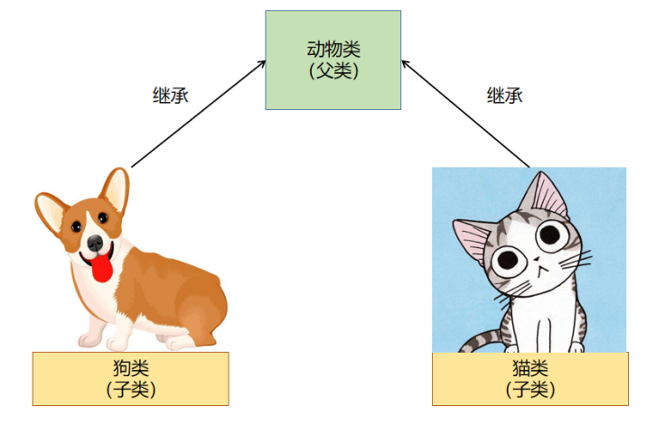

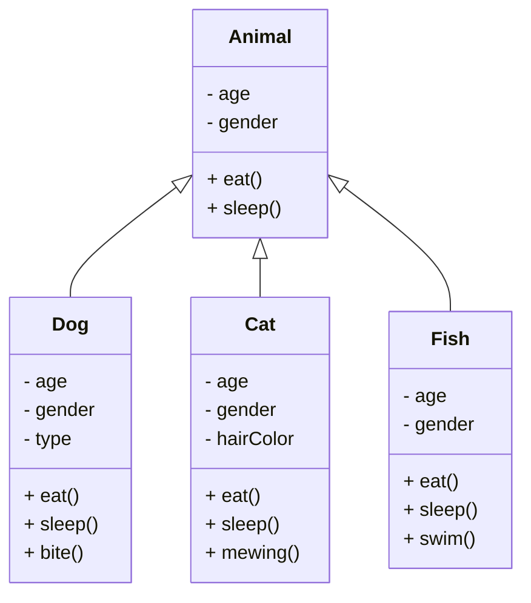

产生继承关系后，子类可以使用父类中的属性和方法，也可以定义子类独有的属性和方法。

```java
class subclass extends superclass {
    // code
}
```

继承时通常使用`public`类型。当一个类`public`继承于父类时，父类的`public`成员也是子类的`public`成员，父类的`protected`成员也是子类的`protected`成员，父类的`private`成员不能被继承。

继承的好处是可以提高代码的复用性、提高代码的拓展性。

父类中以下内容是不可以被继承的：

1. 构造方法：构造方法是为了创建当前类的对象的。
2. 私有成员：私有成员只能在当前的类中使用。
3. 跨包子类：默认权限的属性、方法，不可以继承给跨包的子类。


**访问权限修饰符**

访问权限修饰符，就是修饰类、属性的访问权限。

|   访问权限修饰符    | 当前类 | 同包其它类 | 跨包子类 | 跨包其它类 |
| :-----------------: | :----: | :--------: | :------: | :--------: |
|     **private**     |   √    |     ×      |    ×     |     ×      |
| **default（不写）** |   √    |     √      |    ×     |     ×      |
|    **protected**    |   √    |     √      |    √     |     ×      |
|     **public**      |   √    |     √      |    √     |     √      |


**super**

使用`super`可以调用父类的方法。子类对象在实例化的时候，需要先实例化从父类继承到的部分，此时默认调用父类中的无参构造方法。

如果父类中没有无参构造方法，对所有的子类对象实例化都会造成影响，导致子类对象无法实例化。

解决方法有两种：

1. 为父类添加无参构造方法。
2. 在子类的构造方法中，使用`super()`调用父类中的有参构造函数。

---

【代码】继承

- Animal.java

```java
public class Animal {
    private String name;
    private int age;

    public Animal() {
        this.name = "";
        this.age = 0;
    }

    public Animal(String name, int age) {
        this.name = name;
        this.age = age;
    }
    
    public void eat() {
        System.out.println("吃饭");
    }

    public void sleep() {
        System.out.println("睡觉");
    }
}
```

- Dog.java

```java
public class Dog extends Animal {
    private String type;

    public Dog(String name, int age, String type) {
        super(name, age);
        this.type = type;
    }
    
    public void bite() {
        System.out.println("咬人");
    }
}
```

- TestDog.java

```java
public class TestDog {
    public static void main(String[] args) {
        Dog dog = new Dog("狗子", 3, "哈士奇");
        dog.eat();
        dog.sleep();
        dog.bite();
    }
}
```

> 运行结果

```
吃饭
睡觉
咬人
```

---

<div style="page-break-after: always;"></div>

## 8.2 重写

**toString()**

`Object`类是Java中类层次的根类，所有的类都直接或者间接地继承自`Object`类。`Object`类的`toString()`方法返回一个字符串，该字符串由类名、标记符`@`和此对象的哈希码的无符号十六进制表示组成。

---

【代码】toString()

- Dog.java

```java
public class Dog extends Animal {
    private String name;
    private String type;
    
    public Dog(String name, String type) {
        this.name = name;
        this.type = type;
    }   
}
```

- TestDog.java

```java
public class TestDog {
    public static void main(String[] args) {
        Dog dog = new Dog("狗子", "哈士奇");
        System.out.println(dog);
    }
}
```

> 运行结果

```
Dog@28a418fc
```

---


**重写（Override）**

子类可以继承到父类中的属性和方法，但是有些方法，子类的实现与父类的方法可能实现的不同。当父类提供的方法已经不能满足子类的需求时，子类中可以定义与父类相同的方法。此时，子类方法完成对父类方法的覆盖，称为重写。

重写方法需要注意以下几点：

1. 方法名字必须和父类方法名字相同。
2. 参数列表必须和父类一致。
3. 方法的访问权限需要大于等于父类方法的访问权限。
4. 方法的返回值类型需要小于等于父类方法的返回值类型。

`@Override`是一个注解，用于进行重写前的校验，校验一个方法是否是一个重写的方法，如果不是重写的方法，会直接报错。

`@Override`只是对方法进行重写的验证，与这个方法是不是重写方法无关。在写重写方法的时候，这个注解最好加上。

---

【代码】重写toString()

- Dog.java

```java
public class Dog {
    private String name;
    private String type;
    
    public Dog(String name, String type) {
        this.name = name;
        this.type = type;
    }

    @Override
    public String toString() {
        return "我叫" + this.name + "，我是一只" + this.type;
    }
}
```

- TestDog.java

```java
public class TestDog {
    public static void main(String[] args) {
        Dog dog = new Dog("狗子", "哈士奇");
        System.out.println(dog);
    }
}
```

> 运行结果

```
我叫狗子，我是一只哈士奇
```

---


**equals()**

`==`运算符默认比较的是两个对象的地址，如果地址相同则为`true`，否则为`false`。

`equals()`方法默认返回地址比较，通过重写`equals()`方法，可以自定义两个对象的等值比较规则。

---

【代码】重写equals()

- Dog.java

```java
public class Dog {
    private String name;
    private int age;
    private String type;

    public Dog(String name, int age, String type) {
        this.name = name;
        this.age = age;
        this.type = type;
    }
    
    /**
     * 自定义规则：实现两个对象的等值比较
     * @param obj - 需要比较的对象
     * @return 比较的结果：相同true，不同false 
     */
    @Override
    public boolean equals(Object obj) {
        // 1. 如果两个对象地址相同，返回true
        if(this == obj) {
            return true;
        }
        
        // 2. 如果obj是null，返回false
        if(obj == null) {
            return false;
        }
        
        // 3. 如果两个对象类型不同，返回false
        if(this.getClass() != obj.getClass()) {
            return false;
        }
        
        // 4. 如果两个对象中的属性全部相同，返回true，否则返回false
        Dog dog = (Dog)obj;
        return this.name.equals(dog.name) 
                && this.age == dog.age 
                && this.type.equals(dog.type);
    }
}
```

- TestDog.java

```java
public class TestDog {
    public static void main(String[] args) {
        Dog dog1 = new Dog("狗子", 3, "哈士奇");
        Dog dog2 = new Dog("狗子", 3, "哈士奇");
        
        System.out.println(dog1 == dog2);
        System.out.println(dog1.equals(dog2));
    }
}
```

> 运行结果

```
false
true
```

---

<div style="page-break-after: always;"></div>

# 第9章 多态

## 9.1 多态

**多态（Polymorphism）**

多态是同一个行为具有多个不同表现形式或形态的能力。


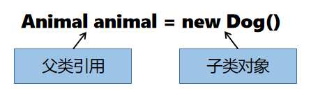

通过父类引用指向子类对象，从而产生多种形态。父类引用仅能访问父类所声明的属性和方法，不能访问子类独有的属性和方法。

在一对有继承关系的类中都有一个方法，其方法名、参数列表、返回值均相同，通过调用方法实现不同类对象完成不同的事件。

<div style="page-break-after: always;"></div>

## 9.2 抽象类

**抽象类（Abstract Class）**

抽象类不能被用于实例化对象，只是提供了所有的子类共有的部分。例如在动物园中，存在的都是“动物”具体的子类对象，并不存在“动物”对象，所以动物类不应该被独立创建成对象。

抽象类的作用是可以被子类继承，提供共性的属性和方法。


**抽象方法（Abstract Method）**

父类提供的方法很难满足子类不同的需求，如果不定义该方法，则表示所有的子类都不具有该行为。如果定义该方法，所有的子类都在重写，那么这个方法在父类中是没有必要实现的，显得多余。

被`abstract`关键字修饰的方法称为抽象方法。抽象方法只有声明，没有实现。抽象方法只能包含在抽象类中。产生继承关系后，子类必须重写父类中所有的抽象方法，否则子类还是抽象类。


**抽象类的使用场景**

非抽象类在继承自一个抽象父类的同时，必须重写实现父类中所有的抽象方法。因此，抽象类可以用来做一些简单的规则制定。在抽象类中制定一些规则，要求所有的子类必须实现，约束所有子类的行为。

但是，类是单继承的，一个类有且只能有一个父类，所以如果一个类需要受到多种规则的约束，无法再继承其它父类。此时可以使用接口进行这样的复杂的规则制定。

<div style="page-break-after: always;"></div>

## 9.3 对象转型

**对象转型**

对象由子类类型转型为父类类型，即是向上转型。向上转型是一种隐式转换，一定会转型成功。向上转型后的对象，只能访问父类中定义的成员。

由父类类型转型转型为子类类型，即是向下转型。向下转型存在失败的可能性，会出现`ClassCastException`异常。向下转型需要进行强制类型转换，是一个显式转换。向下转型后的对象，将可以访问子类中独有的成员。


**instanceof**

向下转型存在失败的可能性。如果引用实际指向的对象，不是要转型的类型，此时强制转换会出现`ClassCastException`异常。所以，在向下转型之前，最好使用`instanceof`关键字进行类型检查。

---

【代码】对象转型

- Animal.java

```java
public abstract class Animal {
    private String name;

    public Animal(String name) {
        this.name = name;
    }

    public abstract void makeSound();
}
```

- Dog.java

```java
public class Dog extends Animal {
    public Dog(String name) {
        super(name);
    }
    
    @Override
    public void makeSound() {
        System.out.println("汪汪~");
    }
}
```

- TestDog.java

```java
public class TestDog {
    public static void main(String[] args) {
        Animal animal = new Dog("狗子");
        if(animal instanceof Dog) {
            Dog dog = (Dog)animal;
            dog.makeSound();
        }
    }
}
```

> 运行结果

```
汪汪~
```

---

<div style="page-break-after: always;"></div>

## 9.4 接口

**接口（Interface）**

在面向对象中会使用抽象类为外部提供一个通用的、标准化的接口。

宏观上来讲，接口是一种标准。例如常见的USB接口，电脑通过USB接口连接各种外设设备，每一个接口不用关心连接的外设设备是什么，只要这个外设设备实现了USB的标准，就可以连接到电脑上。


从程序上来讲，接口代表了某种能力和约定。当父类的方法无法满足子类需求时，可实现接口扩充子类的能力，接口中方法的定义代表能力的具体要求。

定义接口需要使用关键字`interface`，接口中可以定义：

1. 属性：默认都是静态常量，访问权限都是`public`。
2. 方法：默认都是抽象方法，访问权限都是`public`。

接口和抽象类的相同点有：

1. 都不能创建对象。
2. 都具备`Object`类中所定义的方法。
3. 都可以写抽象方法。

接口和抽象类的不同点有：

1. 接口中所有的属性都是公开静态常量，缺省用`public static final`修饰。
2. 接口中所有的方法都是公开抽象方法，缺省用`public abstract`修饰。
3. 接口中没有构造方法、构造代码段和静态代码段。

因为接口中有很多抽象方法，因此非抽象类在实现接口的时候必须重写实现接口中所有的抽象方法。

使用接口可以进行对行为的约束和规则的制定，接口表示一组能力，那么一个类可以接受多种能力的约束。因此一个类可以实现多个接口，实现多个接口的时候，必须要把每一个接口中的方法都实现。如果一个类实现的多个接口中有相同的方法，实现类只需实现一次即可。

---

【代码】接口

- USB.java

```java
public interface USB {
    /**
     * USB接口返回当前连接设备的类型
     * @return 当前连接设备
     */
    String getDeviceInfo();
}
```

- Mouse.java

```java
public class Mouse implements USB {
    @Override
    public String getDeviceInfo() {
        return "mouse";
    }
}
```

- Keyboard.java

```java
public class Keyboard implements USB {
    @Override
    public String getDeviceInfo() {
        return "keyboard";
    }
}
```

- Computer.java

```java
public class Computer {
    // 电脑有2个USB接口
    private USB usb1;
    private USB usb2;
    
    public void setUsb1(USB usb1) {
        this.usb1 = usb1;
    }
    
    public void setUsb2(USB usb2) {
        this.usb2 = usb2;
    }
    
    /**
     * 获取USB接口连接设备的信息
     */
    public String getUsbInfo() {
        return "USB 1: " + this.usb1.getDeviceInfo() + "\n"
                + "USB 2: " + this.usb2.getDeviceInfo();
    }
}
```

- TestUsb.java

```java
public class TestUsb {
    public static void main(String[] args) {
        Computer computer = new Computer();
        
        // 外设设备连接到电脑上
        computer.setUsb1(new Mouse());
        computer.setUsb2(new Keyboard());
        
        System.out.println(computer.getUsbInfo());
    }
}
```

> 运行结果

```
USB 1: mouse
USB 2: keyboard
```

---

<div style="page-break-after: always;"></div>

# 第10章 异常

## 10.1 异常

**异常（Exception）**

异常就是程序在运行过程中出现的非正常的情况。异常本身是一个类，产生异常就是创建异常对象并抛出一个异常对象。Java处理异常的方法是中断处理。

如果程序遇到了未经处理的异常，会导致这个程序无法进行编译或者运行。

`Throwable`类用来描述所有的不正常的情况。

`Throwable`有两个子类：

1. `Error`：描述发生在`JVM`虚拟机级别的错误信息，这些错误无法被处理。
2. `Exception`：描述程序遇到的异常，异常是可以被捕获处理的。

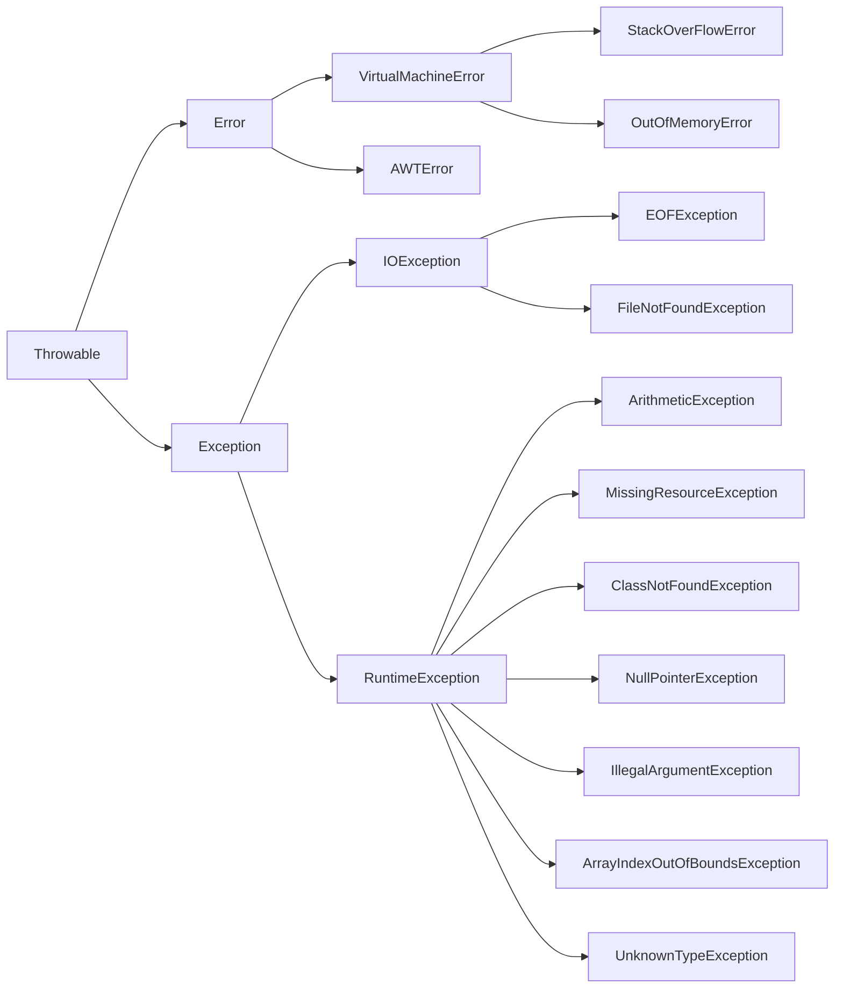

---

【代码】数组越界异常

```java
public class ArrayIndexException {
    public static void main(String[] args) {
        int[] arr = {0, 1, 2, 3, 4};
        System.out.println(arr[5]);
    }
}
```

> 运行结果

```
Exception in thread "main"
java.lang.ArrayIndexOutOfBoundsException: Index 5 out of bounds for length 5
```

---


**异常分类**

普通的异常会导致程序无法完成编译，这样的异常被称为非运行时异常（non-runtime exception），但是由于异常是发生在编译时期的，因此常常称为编译时异常。

`Exception`类有一个子类`RuntimeException`类对异常进了自动的处理，这种异常不会影响程序的编译，但是在运行中如果遇到了这种异常，会导致程序执行的强制停止。这样的异常被称为运行时异常。

<div style="page-break-after: always;"></div>

## 10.2 异常的捕获处理

**try-catch**

如果一个异常不去处理，会导致程序无法编译或者运行。使用`try-catch`语句可以捕获并处理异常。

```java
try {
    // 可能出现异常的代码
} catch(exceptionType e) {
    // 异常的类型和catch的异常的类型匹配，执行此处逻辑
}
```

一个异常如果被捕获处理了，那么将不再影响程序的执行。


如果在`try`结构中出现了异常，那么从异常出现的位置开始，`try`结构中往后的代码将不再执行。

---

【代码】捕获数组越界异常

```java
public class TryCatch {
    public static void main(String[] args) {
        int[] arr = {0, 1, 2, 3, 4};
        try {
            int elem = arr[5];
            System.out.println("elem = " + elem);
        } catch(ArrayIndexOutOfBoundsException e) {
            System.out.println("数组下标越界异常被捕获处理了");
        }
    }
}
```

> 运行结果

```
数组下标越界异常被捕获处理了
```

---


**finally**

`finally`出现在`try-catch`结构的结尾，无论`try`代码段中有没有异常、无论`try`里面出现的异常有没有被捕获处理，`finally`中的代码始终会执行。基于这个特点，常常在`finally`中进行资源释放、流的关闭等操作。

---

【代码】finally

```java
import java.util.Scanner;

public class Finally {
    public static void main(String[] args) {
        Scanner scanner = new Scanner(System.in);
        int[] arr = {0, 1, 2, 3, 4};
        try {
            System.out.print("输入新数据：");
            arr[5] = scanner.nextInt();
        } catch(ArrayIndexOutOfBoundsException e) {
            System.out.println("数组下标越界异常被捕获处理了");
        } finally {
            System.out.println("关闭输入流...");
            scanner.close();
        }
    }
}
```

> 运行结果

```
输入新数据：5
数组下标越界异常被捕获处理了
关闭输入流...
```

---


**catch**

如果多个`catch`捕获的异常类型之间没有继承关系存在，此时先后顺序无所谓。

如果多个`catch`捕获的异常类型之间存在继承关系，则必须保证父类异常在后，子类异常在前。

---

【代码】catch

```java
import java.util.Scanner;
import java.util.InputMismatchException;

public class Catch {
    public static void main(String[] args) {
        Scanner scanner = new Scanner(System.in);
        try {
            System.out.println("【除法运算】");
            System.out.print("输入被除数：");
            int num1 = scanner.nextInt();
            System.out.print("输入除数：");
            int num2 = scanner.nextInt();
            int result = num1 / num2;
            System.out.println("结果：" + result);
        } catch(ArithmeticException e) {
            System.err.println("算术异常");
        } catch(InputMismatchException e) {
            System.err.println("输入类型异常");
        } finally {
            scanner.close();
        }
    }
}
```

> 运行结果

```
【除法运算】
输入被除数：10
输入除数：0
算术异常
```

```
【除法运算】
输入被除数：hey
输入类型异常
```

---

<div style="page-break-after: always;"></div>

## 10.3 throw与throws

**throw / throws**

`throw`关键字用于抛出一个异常，一般用于程序出现某种逻辑时程序员主动抛出某种特定类型的异常。

```java
throw e;
```

`throws`关键字用在声明方法的时候，表示该方法可能要抛出异常。定义了`throws`异常抛出类型的方法，在当前的方法中可以不处理这个异常，由调用方处理。

```java
accessModifier returnType methodName([parameterList]) throws exceptionType {
    // code
}
```

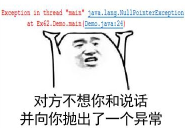

---

【代码】抛出异常

```java
public class Person {
    private int age;
    
    public void setAge(int age) throws Exception {
        if(age < 0 || age > 130) {
            throw new Exception();
        }
        this.age = age; 
    }
    
    public static void main(String[] args) {
        try {
            Person person = new Person();
            person.setAge(-1);
        } catch(Exception e) {
            System.out.println("年龄异常");
        }
    }
}
```

> 运行结果

```
年龄异常
```

---

<div style="page-break-after: always;"></div>

## 10.4 自定义异常

**自定义异常**

使用异常是为了处理一些重大的逻辑bug，这些逻辑bug可能会导致程序的崩溃。此时，可以使用异常机制，强迫修改这个bug。

系统中提供了很多的异常类型，但是异常类型提供地再多，也无法满足所有的需求。当需要的异常类型系统没有提供的时候，此时就需要自定义异常了。

系统提供的每一种异常都是一个类，所以自定义异常其实就是写一个自定义的异常类。自定义的异常类，理论上来讲，类名可以任意定义，但是出于规范，一般都会以`Exception`作为结尾，例如`ArrayIndexOutOfBoundsException`、`NullPointerException`、`ArithmeticException`等。

如果要自定义一个编译时异常，需要继承自`Exception`类，如果要自定义一个运行时异常，需要继承自`RuntimeException`类。

---

【代码】自定义异常

- AgeException.java

```java
public class AgeException extends RuntimeException {
    public AgeException() {
        super("年龄异常");
    }
    
    public AgeException(int age) {
        super("年龄异常：" + age);
    }
}
```

- Person.java

```java
public class Person {
    private int age;
    
    public void setAge(int age) throws AgeException {
        if(age < 0 || age > 130) {
            throw new AgeException(age);
        }
        this.age = age;
    }
    
    public static void main(String[] args) {
        try {
            Person person = new Person();
            person.setAge(-1);
        } catch(AgeException e) {
            e.printStackTrace();
        }
    }
}
```

> 运行结果

```
AgeException: 年龄异常：-1
	at Person.setAge(Person.java:6)
	at Person.main(Person.java:15)
```

---

<div style="page-break-after: always;"></div>
.
# 第11章 常用类

## 11.1 Math

**Math**

`Math`类是一个数学类，这个类中封装了很多用来做数学计算的方法，而且都是静态方法。

| 成员   | 类型 | 描述                             |
| :----- | :--: | :------------------------------- |
| PI     | 属性 | 圆周率                           |
| E      | 属性 | 自然对数                         |
| abs    | 方法 | 绝对值                           |
| max    | 方法 | 计算两数最大值                   |
| min    | 方法 | 计算两数最小值                   |
| round  | 方法 | 四舍五入                         |
| floor  | 方法 | 向下取整                         |
| ceil   | 方法 | 向上取整                         |
| pow    | 方法 | 幂运算                           |
| sqrt   | 方法 | 平方根                           |
| random | 方法 | 获取一个$ [0, 1)范围内的随机数 $ |

---

【代码】Math

```java
public class TestMath {
    public static void main(String[] args) {
        System.out.println(Math.PI);
        System.out.println(Math.E);

        System.out.println(Math.abs(-123));
        System.out.println(Math.max(11, 22));
        System.out.println(Math.min(11, 22));
        System.out.println(Math.round(2.71));
        System.out.println(Math.floor(2.71));
        System.out.println(Math.ceil(2.71));
        System.out.println(Math.sqrt(121));
        System.out.println(Math.pow(27, 1.0/3));
        System.out.println(Math.random());
    }
}
```

> 运行结果

```
3.141592653589793
2.718281828459045
123
22
11
3
2.0
3.0
11.0
3.0
0.11106805039094847
```

---

<div style="page-break-after: always;"></div>

## 11.2 Random

**Random**

`Random`类是一个专门负责产生随机数的类，在Java中，`Random`类在`java.util`包中，使用之前需要先导包。

其实，随机数的产生是有一个固定的随机数算法的。通过代入一个随机数种子，能够生成一个随机数列。由于算法是固定的，因此如果随机数的种子相同，则生成的随机数列也完全相同。

| 方法        | 参数 | 描述                                                 |
| :---------- | :--: | :--------------------------------------------------- |
| Random      |  无  | 通过将系统时间作为随机数种子，实例化一个`Random`对象 |
| Random      | int  | 通过一个指定的随机数种子，实例化一个`Random`对象     |
| nextInt     |  无  | 生成一个`int`范围内的随机数                          |
| nextInt     | int  | 生成一个$ [0, bound) $范围内的整型随机数             |
| nextFloat   |  无  | 生成一个$ [0, 1) $范围内的float类型的随机数          |
| nextDouble  |  无  | 生成一个$ [0, 1) $范围内的double类型的随机数         |
| nextBoolean |  无  | 随机生成一个`boolean`数值                            |

---

【代码】Random

```java
import java.util.Random;

public class TestRandom {
    public static void main(String[] args) {
        Random random = new Random();

        System.out.println(random.nextInt());       // [-2^31, 2^31-1)
        System.out.println(random.nextInt(100));    // [0, 100)
        System.out.println(random.nextFloat());     // [0, 1)
        System.out.println(random.nextDouble());    // [0, 1)
        System.out.println(random.nextBoolean());   // {true, false}
    }
}
```

> 运行结果

```
-1660376775
21
0.7046831
0.5488503115436133
false
```

---

<div style="page-break-after: always;"></div>

## 11.3 BigInteger与BigDecimal

**BigInteger / BigDecimal**

`BigInteger`类和`BigDecimal`类都是描述非常大的数字的类。即使是`long`类型或`double`类型，也有它表示不了的情况。

`BigInteger`类表示整型数字，不限范围。`BigDecimal`类表示浮点型数字，不限范围，不限小数点后面的位数。

| 方法               |          参数           | 描述                                                         |
| ------------------ | :---------------------: | ------------------------------------------------------------ |
| 构造方法           |         String          | 通过一个数字字符串，实例化一个对象                           |
| add                | BigInteger / BigDecimal | 加法                                                         |
| subtract           | BigInteger / BigDecimal | 减法                                                         |
| multiply           | BigInteger / BigDecimal | 乘法                                                         |
| divide             | BigInteger / BigDecimal | 除法                                                         |
| divideAndRemainder | BigInteger / BigDecimal | 除法，保留商和余数，将商存到结果数组的第0位，将余数存到结果数组的第1位 |
| intValue           |           无            | 转成指定的基本数据类型的结果（可能会溢出）                   |
| longValue          |           无            | 转成指定的基本数据类型的结果（可能会溢出）                   |
| floatValue         |           无            | 转成指定的基本数据类型的结果（可能会溢出）                   |
| doubleValue        |           无            | 转成指定的基本数据类型的结果（可能会溢出）                   |

---

【代码】BigInteger

```java
import java.math.BigInteger;

public class BigIntegerOperation {
    public static void main(String[] args) {
        BigInteger num1 = new BigInteger("8372075946288582923997");
        BigInteger num2 = new BigInteger("7370535025821200109");

        System.out.println("Addition: " + num1.add(num2));
        System.out.println("Substraction: " + num1.subtract(num2));
        System.out.println("Multiplication: " + num1.multiply(num2));
        System.out.println("Division: " + num1.divide(num2));
        
        BigInteger[] mod = num1.divideAndRemainder(num2);
        System.out.println("Modulo (quotient): " + mod[0]);
        System.out.println("Modulo (remainder): " + mod[1]);
    }
}
```

> 运行结果

```
Addition: 8379446481314404124106
Substraction: 8364705411262761723888
Multiplication: 61706679000955168878585263937566875115673
Division: 1135
Modulo (quotient): 1135
Modulo (remainder): 6518691981520800282
```

---

<div style="page-break-after: always;"></div>

## 11.4 Date

**Date**

`Date`类是一个用来描述时间、日期的类，在`java.util`包中。

| 方法    | 参数 | 描述                                                         |
| ------- | :--: | ------------------------------------------------------------ |
| Date    |  无  | 实例化一个`Date`对象，来描述系统当前时间                     |
| Date    | long | 通过一个指定的时间戳，实例化一个`Date`对象，描述指定的时间   |
| getTime |  无  | 获取一个日期对应的时间戳，从1970年1月1日0时0分0秒开始计算的毫秒数 |
| setTime | long | 通过修改一个时间的时间戳，修改这个时间对象描述的时间         |
| equals  | Date | 判断两个时间是否相同                                         |
| before  | Date | 判断一个时间是否在另一个时间之前                             |
| after   | Date | 判断一个时间是否在另一个时间之后                             |

---

【代码】Date

```java
import java.util.Date;

public class TestDate {
    public static void main(String[] args) {
        Date date = new Date();
        System.out.println("Current time: " + date);

        long timestamp = date.getTime();
        System.out.println("Timestamp: " + timestamp);

        date.setTime(2000237744635L);
        System.out.println("Future time: " + date);
    }
}
```

> 运行结果

```
Current time: Sat Mar 27 23:06:47 CST 2021
Timestamp: 1616857607149
Future time: Sat May 21 05:35:44 CST 2033
```

---

<div style="page-break-after: always;"></div>

## 11.5 SimpleDateFormat

**SimpleDateFormat**

`SimpleDateFormat`类是一个用来格式化时间的类，使用这个对象一般有两种操作：

1. 将一个`Date`对象转换成指定格式的时间字符串。
2. 将一个指定格式的时间字符串转换成`Date`对象。

在时间格式中，有几个常见的时间占位符：

| 占位符 | 描述                                                         |
| :----: | ------------------------------------------------------------ |
|   y    | 表示年，常用`yyyy`表示长年份，`yy`表示短年份。               |
|   M    | 表示月，常用`MM`表示两位占位，如果月份不够两位，往前补零。   |
|   d    | 表示日，常用`dd`表示两位占位，如果日期不够两位，往前补零。   |
|   H    | 表示时，24小时制，常用`HH`表示两位占位，如果时不够两位，往前补零。 |
|   h    | 表示时，12小时制，常用`hh`表示两位占位，如果时不够两位，往前补零。 |
|   m    | 表示分，常用`mm`表示两位占位，如果分不够两位，往前补零。     |
|   s    | 表示秒，常用`ss`表示两位占位，如果秒不够两位，往前补零。     |
|   S    | 表示毫秒，常用`SSS`表示三位占位，如果毫秒不够三位，往前补零。 |

---

【代码】Date对象转时间字符串

```java
import java.util.Date;
import java.text.SimpleDateFormat;

public class DateToString {
    public static void main(String[] args) {
        Date date = new Date();
        String format = "yyyy/MM/dd HH:mm:ss";
        SimpleDateFormat sdf = new SimpleDateFormat(format);
        System.out.println(sdf.format(date));
    }
}
```

> 运行结果

```
2021/03/27 23:10:00
```

---

<div style="page-break-after: always;"></div>

## 11.6 包装类

**包装类（Wrapper Class）**

包装类就是在基本数据类型的基础上做一层包装。每一个包装类的内部都维护了一个对应的基本数据类型的属性，用来存储管理一个基本数据类型的数据。

包装类是一种引用数据类型，使用包装类，可以使得基本数据类型数据具有引用类型的特征。例如，可以存储在集合中。同时，包装类还添加了若干个特殊的方法。


基本数据类型都有对应的包装类型：

| 基本数据类型 | 包装类型  |
| :----------: | :-------: |
|     byte     |   Byte    |
|    short     |   Short   |
|     int      |  Integer  |
|     long     |   Long    |
|    float     |   Float   |
|    double    |  Double   |
|     char     | Character |
|   boolean    |  Boolean  |


**装箱/拆箱**

由基本数据类型完成向对应的包装类型进行转换的过程称为装箱。通过包装类的静态方法`valueOf()`完成：每一个包装类中都有一个静态方法`valueOf()`，这个方法的参数是包装类型对应的基本数据类型。

由包装类型完成向对应的基本数据类型进行转换的过程称为拆箱。手动拆箱的方法是使用每一个包装类对象的`xxxValue()`方法，这里的`xxx`表示需要转型的基本数据类型。例如需要转型为`int`类型，则直接调用`intValue()`即可。

---

【代码】手动装箱/拆箱

```java
public class Boxing {
    public static void main(String[] args) {
        Byte data1 = Byte.valueOf((byte)10);
        byte d1 = data1.byteValue();

        Short data2 = Short.valueOf((short)10);
        short d2 = data2.shortValue();

        Integer data3 = Integer.valueOf(10);
        int d3 = data3.intValue();

        Long data4 = Long.valueOf(10L);
        long d4 = data4.longValue();

        Float data5 = Float.valueOf(3.14f);
        float d5 = data5.floatValue();

        Double data6 = Double.valueOf(3.14);
        double d6 = data6.doubleValue();

        Character data7 = Character.valueOf('x');
        char d7 = data7.charValue();

        Boolean data8 = Boolean.valueOf(false);
        boolean d8 = data8.booleanValue();
    }
}
```

---

某些包装类对象，除了可以拆箱成对应的基本数据类型的数据之外，还可以将包装起来的数据转成其它的基本数据类型的数据。例如`Integer`，除了有`intValue()`以外，还有`byteValue()`等方法，其实就是将包装类中包装起来的int数据，强转成`byte`类型返回结果。

在`JDK 1.5`之后，装箱和拆箱是可以自动完成的，只需要一个赋值语句即可。

---

【代码】自动装箱/拆箱

```java
public class AutoBoxing {
    public static void main(String[] args) {
        Integer num = 10;
        int n = num;
    }
}
```

---

<div style="page-break-after: always;"></div>

# 第12章 字符串

## 12.1 字符串与基本数据类型的转换

**基本数据类型转换字符串**

基本数据类型转成字符串，得到的结果是这个数值添加上双引号的样式。

基本数据类型转换字符串有4种方法：

1. 利用字符串拼接运算完成：当加号两端有任意一方式字符串的时候，此时会自动的把另一方也转成字符串，完成字符串的拼接。所以，当需要把一个基本数据类型转成字符串的时候，只需要在另一端拼接上一个空的字符串即可。
2. 【推荐使用】使用字符串的静态方法`valueOf()`完成。
3. 借助包装类的实例方法`toString()`完成。
4. 借助包装类的静态方法`toString()`完成。

---

【代码】基本数据类型转换字符串

```java
public class BasicToString {
    public static void main(String[] args) {
        int num = 10;
        
        // 1. 利用字符串拼接运算完成
        String s1 = num + "";
        System.out.println(s1);
        
        // 2. 【推荐使用】使用字符串的静态方法valueOf()完成
        String s2 = String.valueOf(num);
        System.out.println(s2);
        
        // 3. 借助包装类的实例方法toString()完成
        String s3 = Integer.valueOf(num).toString();
        System.out.println(s3);
        
        // 4. 借助包装类的静态方法toString()完成
        String s4 = Integer.toString(10);
        System.out.println(s4);
    }
}
```

> 运行结果

```
10
10
10
10
```

---


**字符串转换基本数据类型**

字符串转换基本数据类型，就是解析出字符串中的内容，转型成对应的基本数据类型的表示。

需要注意的是，基本数据类型转字符串肯定是没有问题的，但是由字符串类型转换基本数据类型的时候，可能会出现问题。字符串中的内容不一定能够转成希望转换的基本数据类型。如果转换失败，会出现`NumberFormatException`异常。

还需要注意的是，对于整数来说，字符串中如果出现了其它的非数字的字符串，都会导致转整数失败。即便是小数点，也不可以转换，因为这里并没有转成浮点数再转成整数的过程。

字符串转换基本数据类型的方法有2种：

1. 使用包装类的静态方法`valueOf()`完成。
2. 使用包装类的静态方法`parseXXX()`完成。

---

【代码】字符串转换基本数据类型

```java
public class StringToBasic {
    public static void main(String[] args) {
        // 1. 使用包装类的静态方法valueOf()完成
        Integer num1 = Integer.valueOf("10");
        System.out.println(num1);
        
        // 2. 使用包装类的静态方法parseXXX()完成
        int num2 = Integer.parseInt("10");
        System.out.println(num2);
    }
}
```

> 运行结果

```
10
10
```

---

以上两种方法都可以完成字符串到基本数据类型之间的转换。如果希望直接转成基本数据类型，推荐使用方法2；如果希望得到包装类型，推荐使用方法1。

<div style="page-break-after: always;"></div>

## 12.2 字符串内存分析

**字符串内存分析**

字符串是一个引用数据类型，但是字符串的引用与在面向对象部分的引用有一点差别。对于类的对象，是在堆上开辟的空间，而字符串，是在常量池中开辟的空间。

例如`String str = "hello"`，`"hello"`是在常量池中开辟的空间，而str里面存储的其实是常量池中`"hello"`的地址。当`String str = "world"`时，并不是修改了`str`指向的空间的内容。因为常量池空间特性，一个空间一旦开辟完成了，里面的值是不允许修改的。此时，是在常量池中开辟了一块新的空间，存储了`"world"`，并把这个新的空间的地址赋值给`str`。

---

【代码】字符串内存分析

```java
public class StringMemory {
	public static void main(String[] args) {
		// 第一次使用"hello world"时，常量池中并没有这块内存
		// 此时开辟一块新空间存储"hello world"，将其地址赋给s1
		String s1 = "hello world";
		// 再次使用"hello world"时，常量池中已经存在这块内存
		// 此时无需开辟新空间，直接将现有空间地址赋给s2
		String s2 = "hello world";
		// s1和s2都指向"hello world"
		System.out.println(s1 == s2);
	}
}
```

> 运行结果

```
true
```

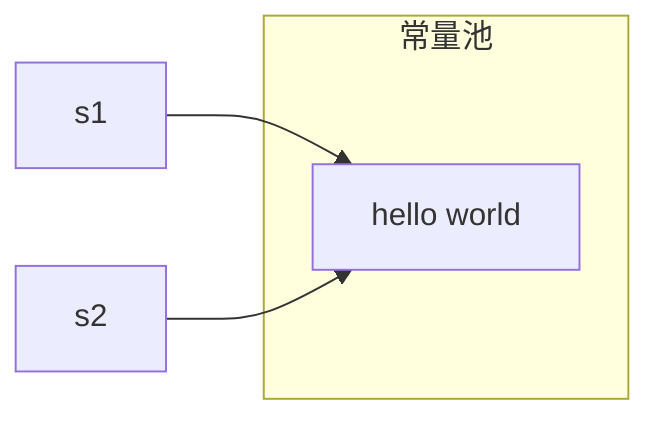

---

`String`类是Java中用来描述字符串的类，里面也是有构造方法的。通过`String`类提供的构造方法，实例化的字符串对象是在堆上开辟的空间。在堆空间中，有一个内部维护的属性，指向了常量池中的某一块空间。

---

【代码】实例化字符串

```java
public class InstantiateString {
    public static void main(String[] args) {
        // 在堆上开辟了一个String对象的空间，将堆的地址赋给s1
        // 堆空间中有一个内部的属性，指向常量池中的"hello world"
        String s1 = new String("hello world");
        // 在堆上开辟了一个String对象的空间，将堆的地址赋给s2
        // 堆空间中有一个内部的属性，指向常量池中的"hello world"
        String s2 = new String("hello world");
        
        // 此时s1和s2是两块堆空间的地址
        System.out.println(s1 == s2);
        // String类中重写了equals()，实现了比较实际指向常量池中的字符串
        System.out.println(s1.equals(s2));
    }
}
```

> 运行结果

```
false
true
```

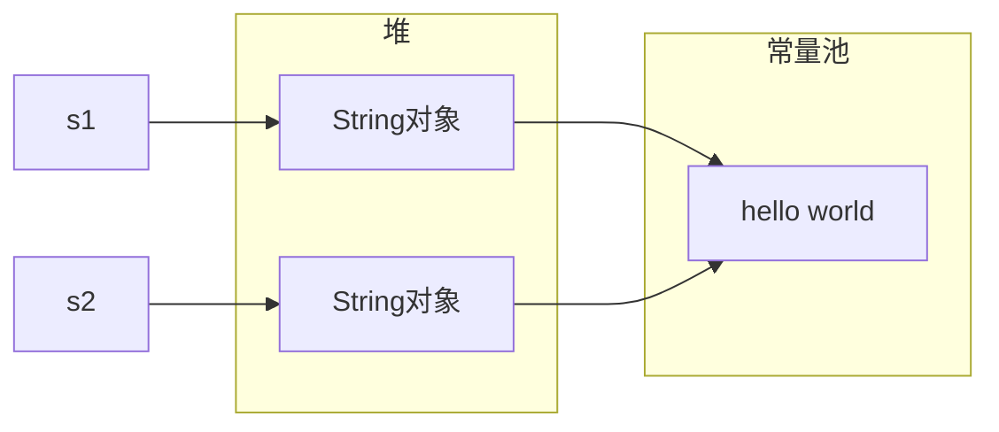

---

<div style="page-break-after: always;"></div>

## 12.3 字符串构造方法

**字符串构造方法**

| 构造方法                                  | 方法描述                                                     |
| ----------------------------------------- | ------------------------------------------------------------ |
| String()                                  | 无参构造，实例化一个空的字符串对象。                         |
| String(String str)                        | 通过一个字符串，实例化另外一个字符串。                       |
| String(char[] arr)                        | 通过一个字符数组，实例化一个字符串，将字符数组中的所有字符拼接到一起。 |
| String(char[] arr, int offset, int count) | 通过一个字符数组，实例化一个字符串，将字符数组中的指定范围的字符拼接到一起。 |
| String(byte[] arr)                        | 通过一个字节数组，实例化一个字符串，将字节数组中的所有字节拼接成字符串。 |
| String(byte[] arr, int offset, int count) | 通过一个字节数组，实例化一个字符串，将字节数组中的指定范围的字节拼接成字符串。 |

---

【代码】字符串构造方法

```java
public class StringConstructor {
    public static void main(String[] args) {
        String s1 = new String();
        System.out.println("s1: " + s1);
        
        String s2 = new String("hello");
        System.out.println("s2: " + s2);
        
        String s3 = new String(new char[] {'h', 'e', 'l', 'l', 'o'});
        System.out.println("s3: " + s3);
        
        String s4 = new String(new char[] {'h', 'e', 'l', 'l', 'o'}, 1, 3);
        System.out.println("s4: " + s4);
        
        String s5 = new String(new byte[] {65, 66, 67});
        System.out.println("s5: " + s5);
        
        String s6 = new String(new byte[] {65, 66, 67}, 0, 2);
        System.out.println("s6: " + s6);
    }
}
```

> 运行结果

```
s1: 
s2: hello
s3: hello
s4: ell
s5: ABC
s6: AB
```

---

<div style="page-break-after: always;"></div>

## 12.4 字符串非静态方法

**字符串非静态方法**

因为字符串是常量，任何修改字符串的操作都不会对所修改的字符串造成任何的影响。所有对字符串的修改操作，其实都是实例化了新的字符串对象，在这个新的字符串对象中存储了修改之后的结果，并将这个新的字符串以返回值的形式返回。所以，如果需要得到对一个字符串修改之后的结果，需要接收方法的返回值。

| 返回值 | 方法                                        | 方法描述                                                     |
| :----: | ------------------------------------------- | ------------------------------------------------------------ |
| String | concat(String str)                          | 将一个字符串与另一个字符串进行拼接，并返回拼接之后的结果。   |
| String | substring(int beginIndex)                   | 字符串截取，从`beginIndex`开始一直截取到字符串的结尾。       |
| String | substring(int beginIndex, int endIndex)     | 字符串截取，截取字符串中$ [beginIndex, endIndex) $范围内的子字符串。 |
| String | replace(char oldChar, char new Char)        | 字符串替换，用新的字符替换原字符串中所有的旧字符。           |
| String | replace(CharSequence old, CharSequence new) | 字符串替换，用新的字符序列替换原字符串中所有的旧字符序列。   |
|  char  | charAt(int index)                           | 获取指定位置的字符。                                         |
|  int   | indexOf(char c)                             | 获取某一个字符在一个字符串中第一次出现的下标，如果没有出现返回`-1`。 |
|  int   | indexOf(char c, int fromIndex)              | 获取某一个字符在一个字符串中从`fromIndex`位置开始第一次出现的下标，如果没有出现返回`-1`。 |
|  int   | lastIndexOf(char c)                         | 获取某一个字符在一个字符串中最后一次出现的下标，如果没有出现返回`-1`。 |
|  int   | lastIndexOf(char c, int fromIndex)          | 获取某一个字符在一个字符串中从`fromIndex`位置开始往前最后一次出现的下标，如果没有出现返回`-1`。 |

---

【代码】字符串非静态方法

```java
public class StringMethod {
    public static void main(String[] args) {
        // 1. 判断空字符串
        System.out.println("".isEmpty());
        
        // 2. 字符串长度
        System.out.println("Hello World".length());
        
        // 3. 字符串拼接
        System.out.println("Hello".concat("World"));
        
        // 4. 字符串截取
        System.out.println("Hello World".substring(4));
        System.out.println("Hello World".substring(4, 8));
        
        // 5. 字符串替换
        System.out.println("Hello World".replace('l', 'L'));
        System.out.println("Hello World".replace("Hello", "Bye"));
        
        // 6. 获取指定位置字符
        System.out.println("Hello".charAt(1));
        
        // 7. 查询字符位置
        System.out.println("Hello World".indexOf('l'));
        System.out.println("Hello World".indexOf('l', 5));
        System.out.println("Hello World".lastIndexOf('l'));
        System.out.println("Hello World".lastIndexOf('l', 5));
        
        // 8. 去除字符串首位空白字符
        System.out.println("   Hello World   ".trim());
        
        // 9. 大小写转换
        System.out.println("Hello World".toLowerCase());
        System.out.println("Hello World".toUpperCase());
        
        // 10. 判断是否存在子串
        System.out.println("Hello World".contains("llo"));
        
        // 11. 判断是否以指定字符串开头/结尾
        System.out.println("Hello World".startsWith("Hell"));
        System.out.println("Hello World".endsWith("ld"));
        
        // 12. 判断两个字符串内容是否相同
        System.out.println("Hello".equals("Hello"));
        
        // 13. 判断两个字符串内容是否相同（忽略大小写）
        System.out.println("Hello".equalsIgnoreCase("hello"));
        
        // 14. 比较两个字符串大小
        System.out.println("Hello".compareTo("Hall"));
        
        // 15. 比较两个字符串大小（忽略大小写）
        System.out.println("Hello".compareToIgnoreCase("HELLO"));
    }
}
```

> 运行结果

```
true
11
HelloWorld
o World
o Wo
HeLLo WorLd
Bye World
e
2
9
9
3
Hello World
hello world
HELLO WORLD
true
true
true
true
true
4
0
```

---

<div style="page-break-after: always;"></div>

## 12.5 字符串静态方法

**字符串静态方法**

| 返回值 | 方法                                                | 方法描述                                                     |
| :----: | --------------------------------------------------- | ------------------------------------------------------------ |
| String | join(CharSequence delimiter, CharSequence elements) | 将若干个字符串拼接到一起，在拼接的时候，元素与元素之间以指定的分隔符进行分割。 |
| String | format(String format, Object... args)               | 以指定的格式，进行字符串的格式化。                           |


**占位符**

| 占位符 | 描述           | 备注                                 |
| :----: | -------------- | ------------------------------------ |
|   %s   | 代替字符串     | `%ns`表示凑够`n`位，如果不够不空格。 |
|   %d   | 代替整型数字   | `%nd`表示凑够`n`位，如果不够不空格。 |
|   %f   | 代替浮点型数字 | `%.nf`表示保留小数点后`n`位数字。    |
|   %c   | 代替字符       |                                      |

---

【代码】字符串静态方法

```java
public class StringStaticMethod {
    public static void main(String[] args) {
        // join()：字符串拼接
        String[] info = {"2021", "3", "28"};
        String date = String.join("/", info);
        System.out.println(date);

        // format()：字符串格式化
        String name = "小灰";
        int age = 18;
        char gender = 'M';
        double height = 178.2;
        System.out.println(String.format(
                "姓名：%s，年龄：%d，性别：%c，身高：%.2f", 
                name, age, gender, height));
    }
}
```

> 运行结果

```
2021/3/28
姓名：小灰，年龄：18，性别：M，身高：178.20
```

---

<div style="page-break-after: always;"></div>

## 12.6 StringBuffer与StringBuilder

**StringBuffer / StringBuilder**

字符串是常量，所有操作字符串的方法都不能直接修改字符串本身。如果需要得到修改之后的结果，就需要接收返回值。

`StringBuffer`和`StringBuilder`类不是字符串类，而是用来操作字符串的类。在类中维护了一个字符串的属性，这些字符串操作类中的方法，可以直接修改这个属性的值。对于使用方来说，可以不去通过返回值获取操作的结果。

| 返回值                       | 方法名称                                | 方法描述                                                     |
| ---------------------------- | --------------------------------------- | ------------------------------------------------------------ |
|                              | 构造方法()                              | 实例化一个字符串操作类对象，操作的是一个空字符串。           |
|                              | 构造方法(String str)                    | 实例化一个字符串操作类对象，操作的是一个指定的字符串。       |
| StringBuffer / StringBuilder | append(...)                             | 将一个数据拼接到现有的字符串的结尾。                         |
| StringBuffer / StringBuilder | insert(int offset, ...)                 | 将一个数据插入到字符串的指定位置。                           |
| StringBuffer / StringBuilder | delete(int start, int end)              | 删除一个字符串中$ [start, end) $范围内的数据，如果`start`越界会出现下标越界异常，如果`end`越界没影响，会将字符串后面的所有的内容都删除。 |
| StringBuffer / StringBuilder | deleteCharAt(int index)                 | 删除指定下标位置的字符                                       |
| StringBuffer / StringBuilder | replace(int start, int end, String str) | 将字符串中$ [start, end) $范围内的数据替换成指定的字符串。   |
| void                         | setCharAt(int index, char c)            | 将指定下标位置的字符串替换成新的字符。                       |
| StringBuffer / StringBuilder | reverse()                               | 将一个字符串前后倒置、翻转。                                 |
| String                       | toString()                              | 返回一个正在操作的字符串。                                   |

---

【代码】StringBuffer / StringBuilder

```java
public class TestStringBuffer {
    public static void main(String[] args) {
        StringBuffer sb = new StringBuffer("hello");
        System.out.println(sb);
        
        sb.append("world!");
        System.out.println(sb);
        
        sb.insert(5, ", ");
        System.out.println(sb);
        
        sb.delete(5, 7);
        System.out.println(sb);
        
        sb.replace(0, 5, "Hi");
        System.out.println(sb);
        
        sb.setCharAt(2, 'W');
        System.out.println(sb);
        
        sb.reverse();
        System.out.println(sb);
    }
}
```

> 运行结果

```
hello
helloworld!
hello, world!
helloworld!
Hiworld!
HiWorld!
!dlroWiH
```

---


**StringBuffer / StringBuilder的区别**

`StringBuffer`和`StringBuilder`类从功能上来讲是一模一样的，但是他们还是有区别的：

- `StringBuffer`是线程安全的：当处于多线程的环境中，多个线程同时操作这个对象，此时使用`StringBuffer`类。
- `StringBuilder`是线程不安全的：当没有处于多线程的环境中，只有一个线程来操作这个对象，此时使用`StringBuilder`类。

但凡是涉及到字符串操作的使用场景，特别是在循环中对字符串进行的操作，一定不要使用字符串的方法，而要使用`StringBuffer`或者`StringBuilder`的方法来做。

由于字符串本身是不可变的，所以`String`类所有的修改操作，其实都是在方法内实例化了一个新的字符串对象，存储修改之后的新的字符串的地址，返回这个新的字符串。如果操作比较频繁，就意味着有大量的临时字符串被实例化、被销毁，效率极低。

`StringBuffer`和`StringBuilder`类不同，它们在内部维护了一个字符数组，所有的操作都是围绕这个字符数组进行的。当需要转成字符串的时候，才会调用`toString()`方法进行转换。当频繁用到字符串操作的时候，没有中间的临时字符串出现，效率较高。

---

【代码】比较String、StringBuffer、StringBuilder类的效率

```java
public class CompareEfficiency {
    public static void main(String[] args) {
        final int CNT = 100000;
        
        String str = new String();
        StringBuffer stringBuffer = new StringBuffer();
        StringBuilder stringBuilder = new StringBuilder();
        long start, end;
        
        // String拼接
        start = System.currentTimeMillis();
        for(int i = 0; i < CNT; i++) {
            str += i;
        }
        end = System.currentTimeMillis();
        System.out.println("String拼接：" + (end - start));
        
        // StringBuffer拼接
        start = System.currentTimeMillis();
        for(int i = 0; i < CNT; i++) {
            stringBuffer.append(i);
        }
        end = System.currentTimeMillis();
        System.out.println("StringBuffer拼接：" + (end - start));
        
        // StringBuilder拼接
        start = System.currentTimeMillis();
        for(int i = 0; i < CNT; i++) {
            stringBuilder.append(i);
        }
        end = System.currentTimeMillis();
        System.out.println("StringBuilder拼接：" + (end - start));
    }
}
```

> 运行结果

```
String拼接：4326
StringBuffer拼接：2
StringBuilder拼接：2
```

---

<div style="page-break-after: always;"></div>

# 第13章 正则表达式

## 13.1 正则表达式

**正则表达式（Regular Expression）**

正则表达式不是Java所有的，它是一套独立的、自成体系的知识点。在很多语言中都有对正则的使用。

正则表达式是用来做字符串的校验、匹配、验证一个字符串是否与指定的规则匹配。

在很多的语言中，都在匹配的基础上添加了其它的功能。例如Java，在匹配的基础上还添加了删除、替换等功能。

---

【代码】使用与不使用正则表达式的区别

```java
/**
 * 验证一个字符串是否是一个合法的账号
 * 规则：
 *      1. 纯数字组成
 *      2. 不能以0开头
 *      3. 长度[6, 11]
 */
public class CheckAccount {
    public static void main(String[] args) {
        // 不使用正则表达式
        System.out.println(validateAccount("2513276112"));
        System.out.println(validateAccount("012.3"));
        
        // 使用正则表达式
        System.out.println(validateAccountWithRegex("h3ll0"));
        System.out.println(validateAccountWithRegex("28368346"));
    }
    
    public static boolean validateAccount(String account) {
        // 1. 纯数字组成
        int len = account.length();
        for(int i = 0; i < len; i++) {
            if(account.charAt(i) < '0' || account.charAt(i) > '9') {
                return false;
            }
        }
        
        // 2. 不能以0开头
        if(account.startsWith("0")) {
            return false;
        }
        
        // 3. 长度[6, 11]
        if(len < 6 || len > 11) {
            return false;
        }
        
        return true;
    }
    
    public static boolean validateAccountWithRegex(String account) {
        // 第1位数字为[1-9]，后面[0-9]可重复5-10次
        return account.matches("[1-9]\\d{5,10}");
    }       
}
```

> 运行结果

```
true
false
false
true
```

---

<div style="page-break-after: always;"></div>

## 13.2 匹配规则

**匹配规则**

正则表达式的匹配规则是逐个字符进行匹配，判断是否和正则表达式中定义的规则一致。

`boolean matches(String regex)`是`String`类中的非静态方法，使用字符串对象调用这个方法，参数是一个正则表达式。


**元字符（metacharacter）**

| 元字符 | 意义                                                         |
| :----: | ------------------------------------------------------------ |
|   ^    | 匹配一个字符串的开头，在Java的正则匹配中可以省略不写。       |
|   $    | 匹配一个字符串的结尾，在Java的正则匹配中可以省略不写。       |
|   []   | 匹配一位字符。例如：`[abc]`表示这一位字符可以是`a`或`b`或`c`。`[a-z]`表示这一位字符可以是`[a, z]`范围内的任意字符。`[a-zABC]`表示这一位字符可以是`[a, z]`范围内的任意字符，或者`A`或`B`或`C`。`[a-zA-Z]`表示这一位字符可以是任意的大小写字母。`[^abc]`表示这一位字符可以是除了`a`、`b`、`c`以外的任意字符。 |
|   \    | 转义字符。使得某些特殊字符成为普通字符，可以进行规则的指定。使得某些普通字符变得具有特殊含义。由于正则表达式在Java中是需要写在一个字符串中，而字符串中的`\`也是一个转义字符，因此Java中写正则表达式的时候，转义字符需要使用`\\`。 |
|   \d   | 匹配所有的数字，等同于`[0-9]`。                              |
|   \D   | 匹配所有的非数字，等同于`[^0-9]`。                           |
|   \w   | 匹配所有的单词字符，等同于`[a-zA-Z0-9_]`。                   |
|   \W   | 匹配所有的非单词字符，等同于`[^a-zA-Z0-9_]`。                |
|   .    | 通配符，可以匹配一个任意的字符。                             |
|   +    | 前面的一位或者一组字符，连续出现了一次或多次。               |
|   ?    | 前面的一位或者一组字符，连续出现了一次或零次。               |
|   *    | 前面的一位或者一组字符，连续出现了零次、一次或多次。         |
|   {}   | 对前面的一位或者一组字符出现次数的精准匹配。`{m}`表示前面的一位或者一组字符连续出现了`m`次。`{m,}`表示前面的一位或者一组字符连续出现了至少`m`次。`{m,n}`表示前面的一位或者一组字符连续出现了至少`m`次，最多`n`次。 |
|   ()   | 分组，把某些连续的字符视为一个整体对待。                     |
|   \|   | 作用于整体或者是一个分组，表示匹配的内容可以是任意的一个部分。`abc|123`表示可以是`abc`，也可以是`123`。 |

---

【代码】验证合法性

```java
public class Verification {
    public static void main(String[] args) {
        // 1. 验证QQ账号：长度5-11，首位不为0
        System.out.println("2513276112".matches("[1-9]\\d{4,10}"));
        
        // 2. 验证QQ邮箱：QQ号码@qq.com
        System.out.println("2513276112@qq.com".matches(
            "[1-9]\\d{4,10}@qq\\.com")
        );
        
        // 3. 验证手机号
        System.out.println("13671712345".matches("1[356789]\\d{9}"));
        
        // 4. 验证固定电话：区号（3-4位）-电话号码（8位）
        System.out.println("021-55031234".matches("\\d{3,4}-\\d{8}"));
        
        // 5. 验证126或163邮箱：邮箱名（4-12位有效字符）@126/163.com
        System.out.println("admin123@163.com".matches(
            "\\w{4,12}@(126|163)\\.com")
        );
    }
}
```

> 运行结果

```
true
true
true
true
true
```

---

【代码】手机号中间4位隐藏

```java
public class Mobile {
    public static void main(String[] args) {
        // $1表示获取第1个分组的值
        // $3表示获取第3个分组的值
        System.out.println("13671712345".replaceAll(
            "(\\d{3})(\\d{4})(\\d{3})", 
            "$1****$3"));
    }
}
```

> 运行结果

```
136****2345
```

---