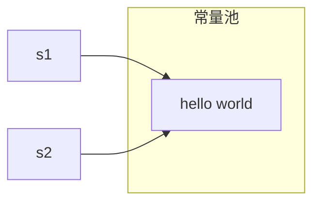
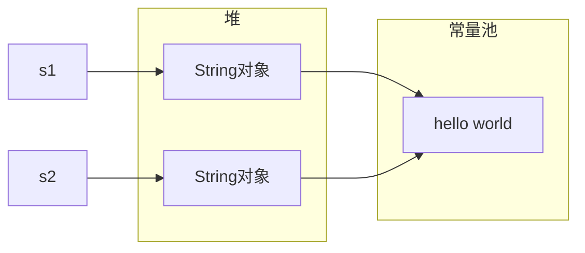

【代码】基本数据类型转换字符串

```java
public class BasicToString {
    public static void main(String[] args) {
        int num = 10;
        
        // 1. 利用字符串拼接运算完成
        String s1 = num + "";
        System.out.println(s1);
        
        // 2. 【推荐使用】使用字符串的静态方法valueOf()完成
        String s2 = String.valueOf(num);
        System.out.println(s2);
        
        // 3. 借助包装类的实例方法toString()完成
        String s3 = Integer.valueOf(num).toString();
        System.out.println(s3);
        
        // 4. 借助包装类的静态方法toString()完成
        String s4 = Integer.toString(10);
        System.out.println(s4);
    }
}
```

> 运行结果

```
10
10
10
10
```

---


**字符串转换基本数据类型**

字符串转换基本数据类型，就是解析出字符串中的内容，转型成对应的基本数据类型的表示。

需要注意的是，基本数据类型转字符串肯定是没有问题的，但是由字符串类型转换基本数据类型的时候，可能会出现问题。字符串中的内容不一定能够转成希望转换的基本数据类型。如果转换失败，会出现`NumberFormatException`异常。

还需要注意的是，对于整数来说，字符串中如果出现了其它的非数字的字符串，都会导致转整数失败。即便是小数点，也不可以转换，因为这里并没有转成浮点数再转成整数的过程。

字符串转换基本数据类型的方法有2种：

1. 使用包装类的静态方法`valueOf()`完成。
2. 使用包装类的静态方法`parseXXX()`完成。

---

【代码】字符串转换基本数据类型

```java
public class StringToBasic {
    public static void main(String[] args) {
        // 1. 使用包装类的静态方法valueOf()完成
        Integer num1 = Integer.valueOf("10");
        System.out.println(num1);
        
        // 2. 使用包装类的静态方法parseXXX()完成
        int num2 = Integer.parseInt("10");
        System.out.println(num2);
    }
}
```

> 运行结果

```
10
10
```

---

以上两种方法都可以完成字符串到基本数据类型之间的转换。如果希望直接转成基本数据类型，推荐使用方法2；如果希望得到包装类型，推荐使用方法1。

<div style="page-break-after: always;"></div>

## 12.2 字符串内存分析

**字符串内存分析**

字符串是一个引用数据类型，但是字符串的引用与在面向对象部分的引用有一点差别。对于类的对象，是在堆上开辟的空间，而字符串，是在常量池中开辟的空间。

例如`String str = "hello"`，`"hello"`是在常量池中开辟的空间，而str里面存储的其实是常量池中`"hello"`的地址。当`String str = "world"`时，并不是修改了`str`指向的空间的内容。因为常量池空间特性，一个空间一旦开辟完成了，里面的值是不允许修改的。此时，是在常量池中开辟了一块新的空间，存储了`"world"`，并把这个新的空间的地址赋值给`str`。

---

【代码】字符串内存分析

```java
public class StringMemory {
	public static void main(String[] args) {
		// 第一次使用"hello world"时，常量池中并没有这块内存
		// 此时开辟一块新空间存储"hello world"，将其地址赋给s1
		String s1 = "hello world";
		// 再次使用"hello world"时，常量池中已经存在这块内存
		// 此时无需开辟新空间，直接将现有空间地址赋给s2
		String s2 = "hello world";
		// s1和s2都指向"hello world"
		System.out.println(s1 == s2);
	}
}
```

> 运行结果

```
true
```



---

`String`类是Java中用来描述字符串的类，里面也是有构造方法的。通过`String`类提供的构造方法，实例化的字符串对象是在堆上开辟的空间。在堆空间中，有一个内部维护的属性，指向了常量池中的某一块空间。

---

【代码】实例化字符串

```java
public class InstantiateString {
    public static void main(String[] args) {
        // 在堆上开辟了一个String对象的空间，将堆的地址赋给s1
        // 堆空间中有一个内部的属性，指向常量池中的"hello world"
        String s1 = new String("hello world");
        // 在堆上开辟了一个String对象的空间，将堆的地址赋给s2
        // 堆空间中有一个内部的属性，指向常量池中的"hello world"
        String s2 = new String("hello world");
        
        // 此时s1和s2是两块堆空间的地址
        System.out.println(s1 == s2);
        // String类中重写了equals()，实现了比较实际指向常量池中的字符串
        System.out.println(s1.equals(s2));
    }
}
```

> 运行结果

```
false
true
```



---

<div style="page-break-after: always;"></div>

## 12.3 字符串构造方法

**字符串构造方法**

| 构造方法                                  | 方法描述                                                     |
| ----------------------------------------- | ------------------------------------------------------------ |
| String()                                  | 无参构造，实例化一个空的字符串对象。                         |
| String(String str)                        | 通过一个字符串，实例化另外一个字符串。                       |
| String(char[] arr)                        | 通过一个字符数组，实例化一个字符串，将字符数组中的所有字符拼接到一起。 |
| String(char[] arr, int offset, int count) | 通过一个字符数组，实例化一个字符串，将字符数组中的指定范围的字符拼接到一起。 |
| String(byte[] arr)                        | 通过一个字节数组，实例化一个字符串，将字节数组中的所有字节拼接成字符串。 |
| String(byte[] arr, int offset, int count) | 通过一个字节数组，实例化一个字符串，将字节数组中的指定范围的字节拼接成字符串。 |

---

【代码】字符串构造方法

```java
public class StringConstructor {
    public static void main(String[] args) {
        String s1 = new String();
        System.out.println("s1: " + s1);
        
        String s2 = new String("hello");
        System.out.println("s2: " + s2);
        
        String s3 = new String(new char[] {'h', 'e', 'l', 'l', 'o'});
        System.out.println("s3: " + s3);
        
        String s4 = new String(new char[] {'h', 'e', 'l', 'l', 'o'}, 1, 3);
        System.out.println("s4: " + s4);
        
        String s5 = new String(new byte[] {65, 66, 67});
        System.out.println("s5: " + s5);
        
        String s6 = new String(new byte[] {65, 66, 67}, 0, 2);
        System.out.println("s6: " + s6);
    }
}
```

> 运行结果

```
s1: 
s2: hello
s3: hello
s4: ell
s5: ABC
s6: AB
```

---

<div style="page-break-after: always;"></div>

## 12.4 字符串非静态方法

**字符串非静态方法**

因为字符串是常量，任何修改字符串的操作都不会对所修改的字符串造成任何的影响。所有对字符串的修改操作，其实都是实例化了新的字符串对象，在这个新的字符串对象中存储了修改之后的结果，并将这个新的字符串以返回值的形式返回。所以，如果需要得到对一个字符串修改之后的结果，需要接收方法的返回值。

| 返回值 | 方法                                        | 方法描述                                                     |
| :----: | ------------------------------------------- | ------------------------------------------------------------ |
| String | concat(String str)                          | 将一个字符串与另一个字符串进行拼接，并返回拼接之后的结果。   |
| String | substring(int beginIndex)                   | 字符串截取，从`beginIndex`开始一直截取到字符串的结尾。       |
| String | substring(int beginIndex, int endIndex)     | 字符串截取，截取字符串中$ [beginIndex, endIndex) $范围内的子字符串。 |
| String | replace(char oldChar, char new Char)        | 字符串替换，用新的字符替换原字符串中所有的旧字符。           |
| String | replace(CharSequence old, CharSequence new) | 字符串替换，用新的字符序列替换原字符串中所有的旧字符序列。   |
|  char  | charAt(int index)                           | 获取指定位置的字符。                                         |
|  int   | indexOf(char c)                             | 获取某一个字符在一个字符串中第一次出现的下标，如果没有出现返回`-1`。 |
|  int   | indexOf(char c, int fromIndex)              | 获取某一个字符在一个字符串中从`fromIndex`位置开始第一次出现的下标，如果没有出现返回`-1`。 |
|  int   | lastIndexOf(char c)                         | 获取某一个字符在一个字符串中最后一次出现的下标，如果没有出现返回`-1`。 |
|  int   | lastIndexOf(char c, int fromIndex)          | 获取某一个字符在一个字符串中从`fromIndex`位置开始往前最后一次出现的下标，如果没有出现返回`-1`。 |

---

【代码】字符串非静态方法

```java
public class StringMethod {
    public static void main(String[] args) {
        // 1. 判断空字符串
        System.out.println("".isEmpty());
        
        // 2. 字符串长度
        System.out.println("Hello World".length());
        
        // 3. 字符串拼接
        System.out.println("Hello".concat("World"));
        
        // 4. 字符串截取
        System.out.println("Hello World".substring(4));
        System.out.println("Hello World".substring(4, 8));
        
        // 5. 字符串替换
        System.out.println("Hello World".replace('l', 'L'));
        System.out.println("Hello World".replace("Hello", "Bye"));
        
        // 6. 获取指定位置字符
        System.out.println("Hello".charAt(1));
        
        // 7. 查询字符位置
        System.out.println("Hello World".indexOf('l'));
        System.out.println("Hello World".indexOf('l', 5));
        System.out.println("Hello World".lastIndexOf('l'));
        System.out.println("Hello World".lastIndexOf('l', 5));
        
        // 8. 去除字符串首位空白字符
        System.out.println("   Hello World   ".trim());
        
        // 9. 大小写转换
        System.out.println("Hello World".toLowerCase());
        System.out.println("Hello World".toUpperCase());
        
        // 10. 判断是否存在子串
        System.out.println("Hello World".contains("llo"));
        
        // 11. 判断是否以指定字符串开头/结尾
        System.out.println("Hello World".startsWith("Hell"));
        System.out.println("Hello World".endsWith("ld"));
        
        // 12. 判断两个字符串内容是否相同
        System.out.println("Hello".equals("Hello"));
        
        // 13. 判断两个字符串内容是否相同（忽略大小写）
        System.out.println("Hello".equalsIgnoreCase("hello"));
        
        // 14. 比较两个字符串大小
        System.out.println("Hello".compareTo("Hall"));
        
        // 15. 比较两个字符串大小（忽略大小写）
        System.out.println("Hello".compareToIgnoreCase("HELLO"));
    }
}
```

> 运行结果

```
true
11
HelloWorld
o World
o Wo
HeLLo WorLd
Bye World
e
2
9
9
3
Hello World
hello world
HELLO WORLD
true
true
true
true
true
4
0
```

---

<div style="page-break-after: always;"></div>

## 12.5 字符串静态方法

**字符串静态方法**

| 返回值 | 方法                                                | 方法描述                                                     |
| :----: | --------------------------------------------------- | ------------------------------------------------------------ |
| String | join(CharSequence delimiter, CharSequence elements) | 将若干个字符串拼接到一起，在拼接的时候，元素与元素之间以指定的分隔符进行分割。 |
| String | format(String format, Object... args)               | 以指定的格式，进行字符串的格式化。                           |


**占位符**

| 占位符 | 描述           | 备注                                 |
| :----: | -------------- | ------------------------------------ |
|   %s   | 代替字符串     | `%ns`表示凑够`n`位，如果不够不空格。 |
|   %d   | 代替整型数字   | `%nd`表示凑够`n`位，如果不够不空格。 |
|   %f   | 代替浮点型数字 | `%.nf`表示保留小数点后`n`位数字。    |
|   %c   | 代替字符       |                                      |

---

【代码】字符串静态方法

```java
public class StringStaticMethod {
    public static void main(String[] args) {
        // join()：字符串拼接
        String[] info = {"2021", "3", "28"};
        String date = String.join("/", info);
        System.out.println(date);

        // format()：字符串格式化
        String name = "小灰";
        int age = 18;
        char gender = 'M';
        double height = 178.2;
        System.out.println(String.format(
                "姓名：%s，年龄：%d，性别：%c，身高：%.2f", 
                name, age, gender, height));
    }
}
```

> 运行结果

```
2021/3/28
姓名：小灰，年龄：18，性别：M，身高：178.20
```

---

<div style="page-break-after: always;"></div>

## 12.6 StringBuffer与StringBuilder

**StringBuffer / StringBuilder**

字符串是常量，所有操作字符串的方法都不能直接修改字符串本身。如果需要得到修改之后的结果，就需要接收返回值。

`StringBuffer`和`StringBuilder`类不是字符串类，而是用来操作字符串的类。在类中维护了一个字符串的属性，这些字符串操作类中的方法，可以直接修改这个属性的值。对于使用方来说，可以不去通过返回值获取操作的结果。

| 返回值                       | 方法名称                                | 方法描述                                                     |
| ---------------------------- | --------------------------------------- | ------------------------------------------------------------ |
|                              | 构造方法()                              | 实例化一个字符串操作类对象，操作的是一个空字符串。           |
|                              | 构造方法(String str)                    | 实例化一个字符串操作类对象，操作的是一个指定的字符串。       |
| StringBuffer / StringBuilder | append(...)                             | 将一个数据拼接到现有的字符串的结尾。                         |
| StringBuffer / StringBuilder | insert(int offset, ...)                 | 将一个数据插入到字符串的指定位置。                           |
| StringBuffer / StringBuilder | delete(int start, int end)              | 删除一个字符串中$ [start, end) $范围内的数据，如果`start`越界会出现下标越界异常，如果`end`越界没影响，会将字符串后面的所有的内容都删除。 |
| StringBuffer / StringBuilder | deleteCharAt(int index)                 | 删除指定下标位置的字符                                       |
| StringBuffer / StringBuilder | replace(int start, int end, String str) | 将字符串中$ [start, end) $范围内的数据替换成指定的字符串。   |
| void                         | setCharAt(int index, char c)            | 将指定下标位置的字符串替换成新的字符。                       |
| StringBuffer / StringBuilder | reverse()                               | 将一个字符串前后倒置、翻转。                                 |
| String                       | toString()                              | 返回一个正在操作的字符串。                                   |

---

【代码】StringBuffer / StringBuilder

```java
public class TestStringBuffer {
    public static void main(String[] args) {
        StringBuffer sb = new StringBuffer("hello");
        System.out.println(sb);
        
        sb.append("world!");
        System.out.println(sb);
        
        sb.insert(5, ", ");
        System.out.println(sb);
        
        sb.delete(5, 7);
        System.out.println(sb);
        
        sb.replace(0, 5, "Hi");
        System.out.println(sb);
        
        sb.setCharAt(2, 'W');
        System.out.println(sb);
        
        sb.reverse();
        System.out.println(sb);
    }
}
```

> 运行结果

```
hello
helloworld!
hello, world!
helloworld!
Hiworld!
HiWorld!
!dlroWiH
```

---


**StringBuffer / StringBuilder的区别**

`StringBuffer`和`StringBuilder`类从功能上来讲是一模一样的，但是他们还是有区别的：

- `StringBuffer`是线程安全的：当处于多线程的环境中，多个线程同时操作这个对象，此时使用`StringBuffer`类。
- `StringBuilder`是线程不安全的：当没有处于多线程的环境中，只有一个线程来操作这个对象，此时使用`StringBuilder`类。

但凡是涉及到字符串操作的使用场景，特别是在循环中对字符串进行的操作，一定不要使用字符串的方法，而要使用`StringBuffer`或者`StringBuilder`的方法来做。

由于字符串本身是不可变的，所以`String`类所有的修改操作，其实都是在方法内实例化了一个新的字符串对象，存储修改之后的新的字符串的地址，返回这个新的字符串。如果操作比较频繁，就意味着有大量的临时字符串被实例化、被销毁，效率极低。

`StringBuffer`和`StringBuilder`类不同，它们在内部维护了一个字符数组，所有的操作都是围绕这个字符数组进行的。当需要转成字符串的时候，才会调用`toString()`方法进行转换。当频繁用到字符串操作的时候，没有中间的临时字符串出现，效率较高。

---

【代码】比较String、StringBuffer、StringBuilder类的效率

```java
public class CompareEfficiency {
    public static void main(String[] args) {
        final int CNT = 100000;
        
        String str = new String();
        StringBuffer stringBuffer = new StringBuffer();
        StringBuilder stringBuilder = new StringBuilder();
        long start, end;
        
        // String拼接
        start = System.currentTimeMillis();
        for(int i = 0; i < CNT; i++) {
            str += i;
        }
        end = System.currentTimeMillis();
        System.out.println("String拼接：" + (end - start));
        
        // StringBuffer拼接
        start = System.currentTimeMillis();
        for(int i = 0; i < CNT; i++) {
            stringBuffer.append(i);
        }
        end = System.currentTimeMillis();
        System.out.println("StringBuffer拼接：" + (end - start));
        
        // StringBuilder拼接
        start = System.currentTimeMillis();
        for(int i = 0; i < CNT; i++) {
            stringBuilder.append(i);
        }
        end = System.currentTimeMillis();
        System.out.println("StringBuilder拼接：" + (end - start));
    }
}
```

> 运行结果

```
String拼接：4326
StringBuffer拼接：2
StringBuilder拼接：2
```

---

<div style="page-break-after: always;"></div>

# 第13章 正则表达式

## 13.1 正则表达式

**正则表达式（Regular Expression）**

正则表达式不是Java所有的，它是一套独立的、自成体系的知识点。在很多语言中都有对正则的使用。

正则表达式是用来做字符串的校验、匹配、验证一个字符串是否与指定的规则匹配。

在很多的语言中，都在匹配的基础上添加了其它的功能。例如Java，在匹配的基础上还添加了删除、替换等功能。

---

【代码】使用与不使用正则表达式的区别

```java
/**
 * 验证一个字符串是否是一个合法的账号
 * 规则：
 *      1. 纯数字组成
 *      2. 不能以0开头
 *      3. 长度[6, 11]
 */
public class CheckAccount {
    public static void main(String[] args) {
        // 不使用正则表达式
        System.out.println(validateAccount("2513276112"));
        System.out.println(validateAccount("012.3"));
        
        // 使用正则表达式
        System.out.println(validateAccountWithRegex("h3ll0"));
        System.out.println(validateAccountWithRegex("28368346"));
    }
    
    public static boolean validateAccount(String account) {
        // 1. 纯数字组成
        int len = account.length();
        for(int i = 0; i < len; i++) {
            if(account.charAt(i) < '0' || account.charAt(i) > '9') {
                return false;
            }
        }
        
        // 2. 不能以0开头
        if(account.startsWith("0")) {
            return false;
        }
        
        // 3. 长度[6, 11]
        if(len < 6 || len > 11) {
            return false;
        }
        
        return true;
    }
    
    public static boolean validateAccountWithRegex(String account) {
        // 第1位数字为[1-9]，后面[0-9]可重复5-10次
        return account.matches("[1-9]\\d{5,10}");
    }       
}
```

> 运行结果

```
true
false
false
true
```

---

<div style="page-break-after: always;"></div>

## 13.2 匹配规则

**匹配规则**

正则表达式的匹配规则是逐个字符进行匹配，判断是否和正则表达式中定义的规则一致。

`boolean matches(String regex)`是`String`类中的非静态方法，使用字符串对象调用这个方法，参数是一个正则表达式。


**元字符（metacharacter）**

| 元字符 | 意义                                                         |
| :----: | ------------------------------------------------------------ |
|   ^    | 匹配一个字符串的开头，在Java的正则匹配中可以省略不写。       |
|   $    | 匹配一个字符串的结尾，在Java的正则匹配中可以省略不写。       |
|   []   | 匹配一位字符。例如：`[abc]`表示这一位字符可以是`a`或`b`或`c`。`[a-z]`表示这一位字符可以是`[a, z]`范围内的任意字符。`[a-zABC]`表示这一位字符可以是`[a, z]`范围内的任意字符，或者`A`或`B`或`C`。`[a-zA-Z]`表示这一位字符可以是任意的大小写字母。`[^abc]`表示这一位字符可以是除了`a`、`b`、`c`以外的任意字符。 |
|   \    | 转义字符。使得某些特殊字符成为普通字符，可以进行规则的指定。使得某些普通字符变得具有特殊含义。由于正则表达式在Java中是需要写在一个字符串中，而字符串中的`\`也是一个转义字符，因此Java中写正则表达式的时候，转义字符需要使用`\\`。 |
|   \d   | 匹配所有的数字，等同于`[0-9]`。                              |
|   \D   | 匹配所有的非数字，等同于`[^0-9]`。                           |
|   \w   | 匹配所有的单词字符，等同于`[a-zA-Z0-9_]`。                   |
|   \W   | 匹配所有的非单词字符，等同于`[^a-zA-Z0-9_]`。                |
|   .    | 通配符，可以匹配一个任意的字符。                             |
|   +    | 前面的一位或者一组字符，连续出现了一次或多次。               |
|   ?    | 前面的一位或者一组字符，连续出现了一次或零次。               |
|   *    | 前面的一位或者一组字符，连续出现了零次、一次或多次。         |
|   {}   | 对前面的一位或者一组字符出现次数的精准匹配。`{m}`表示前面的一位或者一组字符连续出现了`m`次。`{m,}`表示前面的一位或者一组字符连续出现了至少`m`次。`{m,n}`表示前面的一位或者一组字符连续出现了至少`m`次，最多`n`次。 |
|   ()   | 分组，把某些连续的字符视为一个整体对待。                     |
|   \|   | 作用于整体或者是一个分组，表示匹配的内容可以是任意的一个部分。`abc|123`表示可以是`abc`，也可以是`123`。 |

---

【代码】验证合法性

```java
public class Verification {
    public static void main(String[] args) {
        // 1. 验证QQ账号：长度5-11，首位不为0
        System.out.println("2513276112".matches("[1-9]\\d{4,10}"));
        
        // 2. 验证QQ邮箱：QQ号码@qq.com
        System.out.println("2513276112@qq.com".matches(
            "[1-9]\\d{4,10}@qq\\.com")
        );
        
        // 3. 验证手机号
        System.out.println("13671712345".matches("1[356789]\\d{9}"));
        
        // 4. 验证固定电话：区号（3-4位）-电话号码（8位）
        System.out.println("021-55031234".matches("\\d{3,4}-\\d{8}"));
        
        // 5. 验证126或163邮箱：邮箱名（4-12位有效字符）@126/163.com
        System.out.println("admin123@163.com".matches(
            "\\w{4,12}@(126|163)\\.com")
        );
    }
}
```

> 运行结果

```
true
true
true
true
true
```

---

【代码】手机号中间4位隐藏

```java
public class Mobile {
    public static void main(String[] args) {
        // $1表示获取第1个分组的值
        // $3表示获取第3个分组的值
        System.out.println("13671712345".replaceAll(
            "(\\d{3})(\\d{4})(\\d{3})", 
            "$1****$3"));
    }
}
```

> 运行结果

```
136****2345
```

---